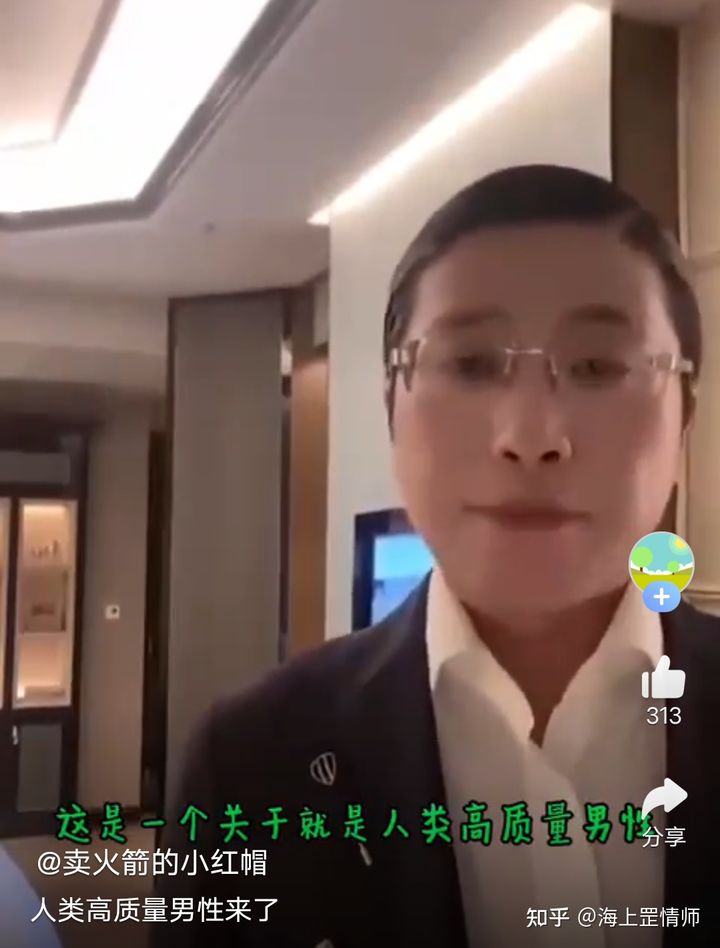
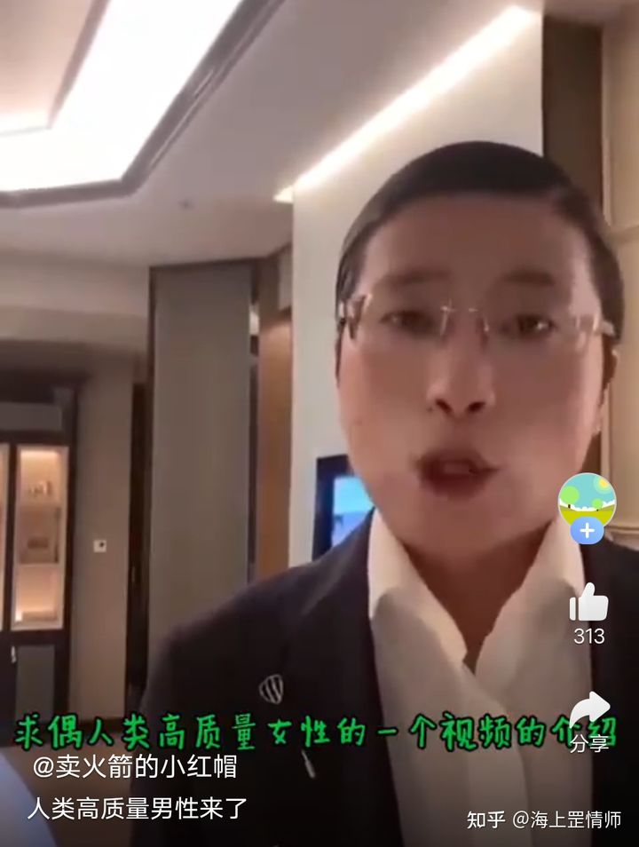
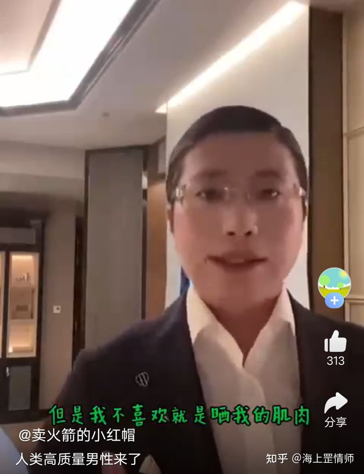
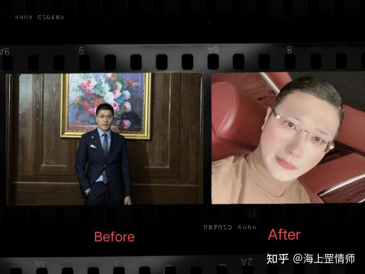
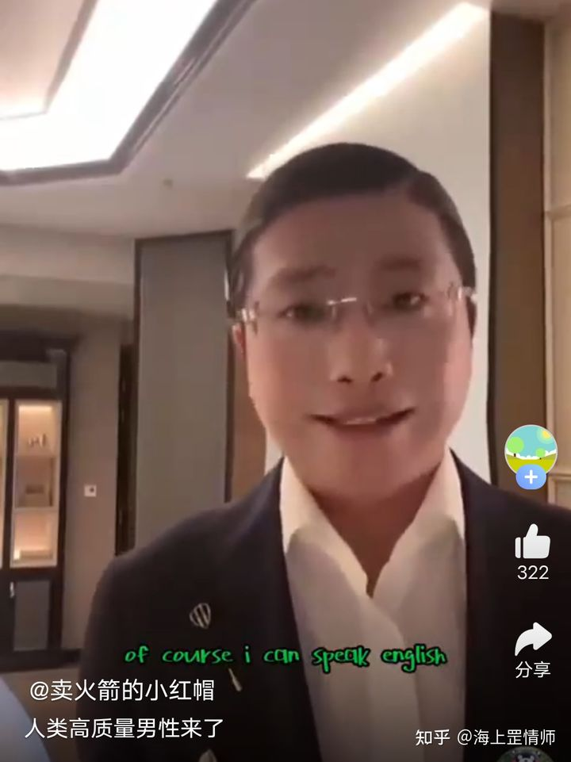
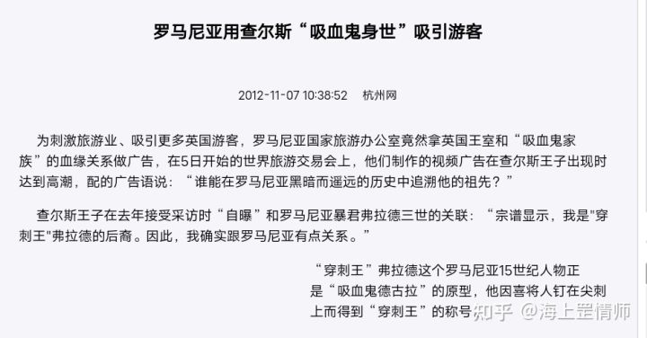

首先，梳理信息:

1，徐自称“人类高质量男性”，标榜自己高质量男性可以理解，但正常人谁会强调自己的“人类”属性？这反而折射出其具有某种“非人类”的自我认知。

2，“求偶人类高质量女性”，这里面有两个关键词:“求偶”、“人类女性”。

求偶这个词语在男女关系中使用不多，更多使用在动物界。这说明徐潜意识里要么对自己的认知是动物，要么将人类看做动物。

为什么要在女性前面再次强调“人类”？这说明在徐的逻辑里，天然的求偶对象原本是涵盖“非人类”女性的，所以才要特别区隔。

3，徐自称自己身材很好，却不喜欢“晒”肌肉，且“比较反感”。加之他着装严实，脸上总是涂着厚厚的粉底，可以合计推断出:如果肌肤暴露在阳光下，可能会对他造成某种痛苦的伤害。

4，通过回顾徐勤根的社交账号内容发现，在 2019 年之前他还非常的正常，只不过去英国消失了一年之后，就变成了现在这个诡异的画风。有理由相信，这一年时间里，他在英国经历了某种不为人知的诡秘。

5，“大半时间都在阅读”。玩手机刷知乎这样的碎片信息获取显然不能称为阅读，阅读是对知识和文化的系统性汲取。他为何必须每天用大半的时间去做这件事？如果不是专研的学者，那基本可以判断为:这个世界对他来说是陌生的，或者他的记忆发生了断层，需要重新熟悉这个世界。

6，在视频里，他特别讲到“of course I can speak English”。对于接受过高等教育的人来说，中文里夹句简单英文的做法挺土的。那他为何还要这么说？这可以解释为他对英语有着不由自主的亲切感和母语般的特殊情结。而对比他展现出的有限英语水准，我们猜测:可能他熟悉的英语和当下人们使用的英语并不完全相同。

7，在提到相处时，徐说“白天可以给您提供一些个人建议”，但提建议为什么一定要在“白天”呢？可以猜测:要么白天他活动受限只能“提建议”，要么晚上他出于某种原因无法相处。

8，在表述“可以不定期或定期给一些财务上的支持”后，徐又突兀地表述“奢侈品实物的支持都是可以的”。按一般理解，只要给钱，菇凉要啥不能自己买？为啥还要你支持奢侈品实物呢？说明这里讲的奢侈品实物并不是可以购买的商品，而可能是某种古董，且存在支持的必要性。

9，按常理说，一个条件不错的男人找对象，总该提一点具体的要求吧，但从始至终徐都没有提。非但没有提要求，他还表示对方“不管有多么奇怪的兴趣爱好都可以尊重”、甚至迎合。可以看出:他完全不在乎对方是什么人，且对“奇怪”的免疫力非常高。

将上述信息连贯起来，可以看到:

一个原本正常的中国小伙，在 2019 年去英国消失一年后，突然发生了诡异的变化。他具有了一种“非人类”的自我认知，对这个世界产生了陌生感，且疑似将人类看做一种动物。他白天活动受限，畏惧在阳光下裸露自己的肌肤，不得不裸露的部位也会打上粉底保护。他对英语表现出了特殊情结，但其现代英语的操使能力与之并不相称。网征对象却不提具体要求，而对“奇怪”极度免疫。

再联想英国是什么地方？那是吸血鬼家族的大本营，穿刺王德古拉后裔之所在啊！

答案已经呼之欲出，我们可以勾勒出这样一幅画面:

2019 年某天，一个名叫徐勤根的中国小伙正在英国旅游，他行至一处古堡，一边游览一边拍照。突然，古堡角落里飞出一只蝙蝠，狠狠地咬在他的脖子上，徐感觉有什么东西注入了自己的体内，意识渐渐变的昏沉起来。迷糊中，他遵循某种血脉指引走进了古堡的地下室。地下室里停放着一排棺材，每一口都是用昂贵的阴沉古木打造而成，堪称奢侈品。他推开其中一口空棺的盖子爬了进去，躺在了天鹅绒的衬垫上，缓缓地合上了棺盖。

过了很长的一段时间，“他”苏醒了，眼里弥漫着浓郁的猩红，继而慢慢淡去重新露出黑色的瞳孔。“他”爬出了棺材，活动了一下身体，感觉到这具身体的契合度虽然不是很高，但也堪使用了。

“他”，这时也许该叫做勤根·徐·德古拉，看了一眼身旁停放的其他棺材，轻叹了声:“凋零是真实的，盛开只是一个过程”，发音是莎士比亚时代的古典英语。

在大量阅读现代书籍，并逐渐融合了这具身体原本的记忆后，徐重新回到了中国，在这灵气复苏的前夜，有着“极高智力和领导力”的他，要在中国快速发展自己的血裔，只有壮大实力，他在面对欧洲那些古老家族时才有话语权。

经过斟酌考量，徐决定先以“求偶”的名义寻找女性发展血裔。这一方面是因为他复苏时间尚短力量不够强，如果对人类成年男性下手，有翻车风险。另一方面是因为血裔同样畏惧阳光，女性可以在脸上涂上厚厚的粉底保护层而不引人怀疑。

现在此人回国时间已经不短，我们无从得知他已经传播了多少人，强烈建议国家对他进行控制，并对他所有密切接触对象进行隔离、甄别。

普通人同样要有防范意识，如果有这么一个女孩，画着浓妆，白天不爱出门，总挑晚上约你，那你千万小心了，这种行为特征高度疑似吸血鬼！

可以采取的措施包括:

1，喂她吃大蒜。

2，让她卸妆然后带她到阳光之下。

3，与她共饮雄黄酒。

4，送她银首饰，并让她当面戴上。

5，在她面前撒一把芥菜种子，看她数不数。
