石家庄人很有意思。

当别人问起石家庄这座城市怎样：

庄里人总是不黑不吹，直接二连反问：

知道万能青年旅店吗？

听过《杀死那个石家庄人》吗？

彷佛在说：

> 喏，这就是石家庄。

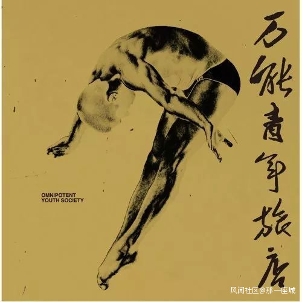

## 如此生活三十年 直到大厦崩塌

万能青年旅店，不是一家旅店，

而是一支组建于 90 年代，土生土长的石家庄乐队。

“几个生活在石家庄的闲散人士，

常年吸工业废气，长年撒泼抒情”。

仅凭一张专辑 8 首歌，莫名其妙红了 10 年。

助力把石家庄从文化沙漠变成：

Rock Home Town（石家庄）。

而一首《杀死那个石家庄人》，

就像一首旧时代的挽歌，

唱尽了在不景气的环境里，

每一个行尸走肉的人，内心被抛弃、遗忘的失落愤怒；

撕破了在体制改革的浪潮里，

每一座不景气的城市，表面上虚假、浮夸的繁荣景象。

表面上看，

这是一家三口日常生活的悲剧。

实际上，谁也说不清：

> 到底是谁杀死了哪个石家庄人，到底是哪座大厦崩塌了？

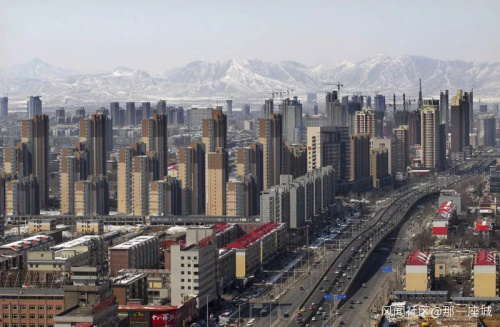

## 云层深处的黑暗啊 淹没心底的景观

傍晚六点下班 换掉药厂的衣裳妻子在熬粥 我去喝几瓶啤酒 如此生活三十年 直到大厦崩塌 云层深处的黑暗啊 淹没心底的景观

80、90 年代的石家庄，是一座纯粹的工业城市。

人们最向往的体面工作，

就是去工厂上班。

七大棉纺厂、机械厂，还有亚洲最大的华北制药厂，

都是响当当的铁饭碗。

工人们朝九晚五，不愁吃穿。

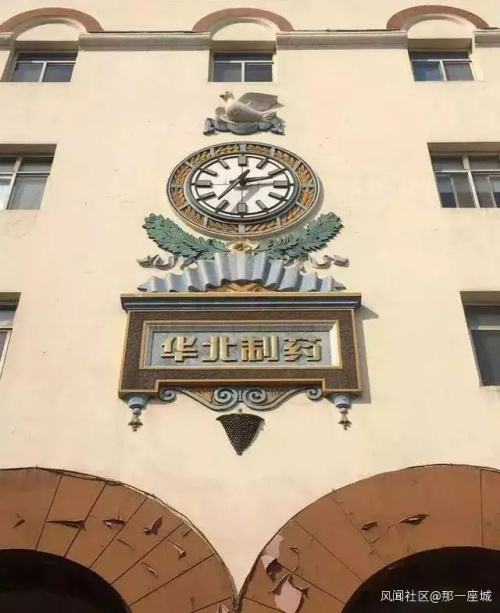

直到市场经济浪潮的到来。

1998 到 2000 年，下岗潮，

毫无征兆地，石家庄里 1/3 的人口，数十万人被迫下岗。

一夜之间，夫妻俩双双失业，

家庭的经济来源断崖式崩塌。

还没整明白到底发生了些什么，下岗的工人们又被迫开始另谋生路：

或者上街摆个小摊，或者混迹于民工之中。

实在饿得发慌，就得去菜市场上偷捡不要的菜叶吃。

瘦弱的药厂工人，大年三十的夜晚，人生第一次打爆米花：

玉米放太多，只爆开一半，一阵阵烧焦的味道弥散在了空气中，

一如当下那种苦涩。

入夜的华北平原，干燥寒冷。

> 就这样，几百万人开始了新生活。

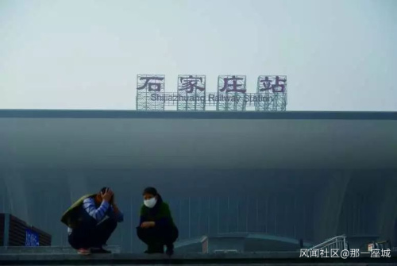

## 夜幕覆盖华北平原 忧伤浸透她的脸

在八角柜台 疯狂的人民商场 用一张假钞 买一把假枪 保卫她的生活 直到大厦崩塌 夜幕覆盖华北平原 忧伤浸透她的脸

90 年代的人民商场，

人们一度错觉，在这里，可以买到一切。

下了岗的家庭主妇们，

多想在这里买买买，回家把屋子填满。

然而一双莫名其妙画着勾的鞋，就要花掉自己的半个月工资——

钱是假的，枪是假的，

能给的安全感，

都是假的。

实实在在付出的，

却是苦的。

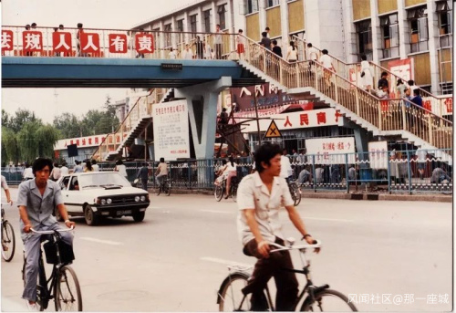

一无所有的人们，为了谋生不择手段。

听过最悲哀的故事是，

在铁西区，多少夫妻走投无路了，

只好出卖自己的身体。

丈夫踩着单车，亲自送妻子去卖淫，

妻子进门后，丈夫便在门口等着，

等着妻子完活，一起归家。

直到撑不下去了：

买点肉包顿饺子，

等女儿放学回家，

一家三口吃下，

> 放了毒鼠强的饺子。

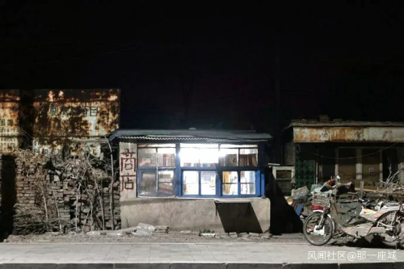

## 一万匹脱缰的马 在他脑海中奔跑

河北师大附中 乒乓少年背向我 沉默的注视 无法离开的教室 生活在经验里 直到大厦崩塌 一万匹脱缰的马 在他脑海中奔跑

90 年代，考上河北师大附中的，

基本都是所谓“别人家的孩子”。

风靡全国的乒乓球活动，曾是那个时代里“快乐少年”的象征。

这样无忧无虑的孩子，

原本只需等到中学毕业，就可以进入体制内的工厂，

然后子承父钵，安稳过完下半辈子。

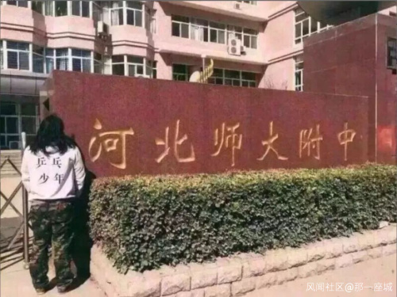

体制改革，

改写了看似无关的一代年轻人的命运。

一觉醒来，物是人非，整个社会规则都变了样。

没有了制度的保护：

劳动不再最光荣；沿海的投资却可遇而不可求。

人逐渐成为了金钱的奴隶。

书本上教的那些纯粹、美好的价值观，

逐渐：混乱、崩塌。

> 少年的生活节奏乱了奏，内心彷徨却又无处发泄。

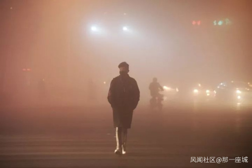

## 继续生活三十年 直到大厦崩塌

石家庄，原本就是两个庄：

一个石家庄，一个休门。

偏偏在解放时期，幸运地成为第一座被解放的大城市。

在天子脚下享用地位与名声，却也被不动声色地拉走资源，默默地为首都保驾护航。

人们在这里安稳度日，生活在云里雾里。看不清楚当下，也没想要看清未来。

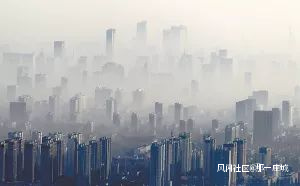

奋进的年轻人不愿留下。

留下的人，在挣扎中，

继续如此生活 30 年，

哪怕再没有大厦会崩塌。

这么一首有时代印记的石家庄歌曲，却迅速火遍大江南北：

从华北平原，唱到海峡对岸。

人们大概不知道华北制药、人民商场、河北师大附中在哪，

但每一个人，又都极容易对号入座——

这是一首唱出了青年内心迷茫的歌。

人人都像万能青年旅店那唱的一样。

面对家乡万年不变的死气沉沉，

一边厌弃，却想试图拯救；

一边依旧迷茫，却又努力挣扎。

在每个天空灰白、死气沉沉的城市里，

人人都是“被杀死的那个石家庄人”。

> 继续生活三十年 直到大厦崩塌

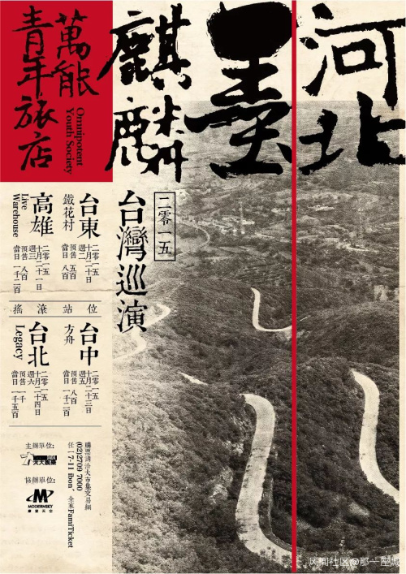
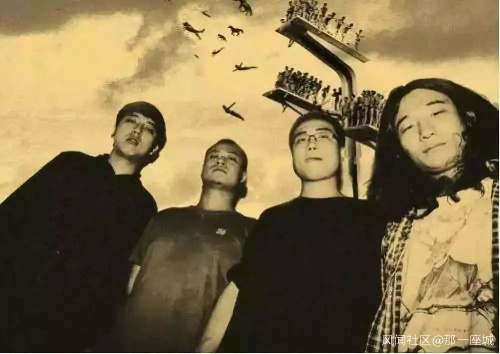