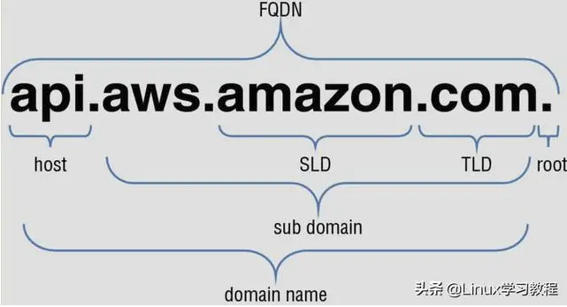
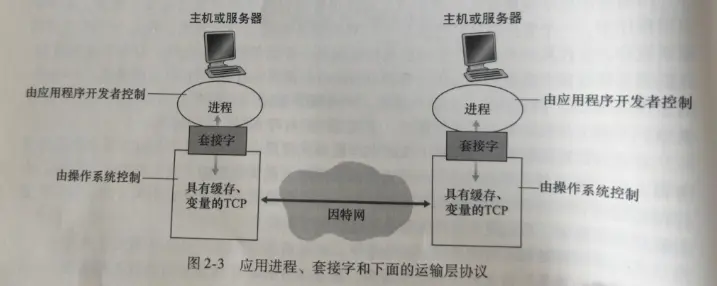
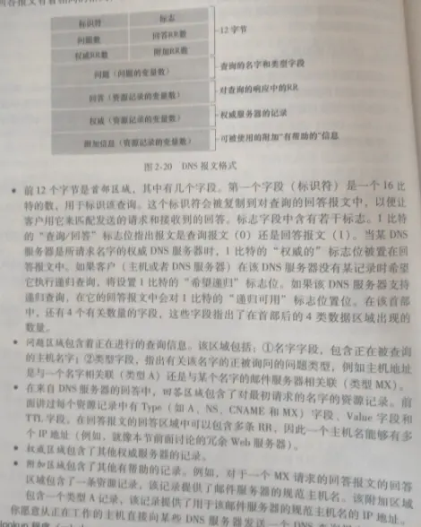

### For Http



FQDN 总长度不超过 255 个字符，两个 . 之间的字符不超过 63 个

当连接到主机(例如，使用 SSH 客户机)时，必须指定 FQDN(与 URL 的区别是没有 protocal 和 resource)。然后，DNS 服务器通过查看其 DNS 表将主机名解析为其 IP 地址。与主机取得联系，您将收到一个登录提示

### 应用层协议原理

应用程序由通信进程对组成。每对中的两个进程互相发送报文。进程通过**套接字(socket)**向网络发送或请求报文

套接字是同一台主机内应用层和运输层之间的接口

SSL 是在应用层实现的，是对 TCP 的一种加强

为了寻址，因此主机由**IP 地址**标识；进程由**端口号(port number)**标识（[固定端口参考](https://www.iana.org)）

### 应用层协议

**应用层协议(application-layer protocol)**定义了运行在不同端系统上的应用程序如何相互传递报文。

**非持续连接(non-persistent connection)**指每个请求/响应对是经一个单独的 TCP 连接发送

**持续连接(persistent connection)**指所有请求及响应经相同的 TCP 连接发送

### DNS

用于将主机名解析为 ip 地址的服务

DNS 是

1. 一个由分层的\***\*DNS 服务器实现的**分布式数据库\*\*
2. 一个使得主机能够查询分布式数据库的**应用层协议**

DNS 服务器通常是运行 BIND(Berkeley Internet Name Domain)软件的 UNIX 机器。DNS 协议运行在 UDP 之上，使用 53 端口

**递归查询**指该查询以自己的名义请求；
**迭代查询**指所有回答都是直接返回其他 ip 地址

通常的查询都遵从：从请求主机到本地 dns 服务器的查询是递归的，其余查询是迭代的

#### DNS 记录和报文

whois 数据库是所有已注册域名的列表

DNS 服务器存储了**资源记录(Resource Record, RR)**，RR 提供了主机名到 ip 地址的映射。RR 是一个四元组`(Name, Value, Type, TTL)`

其中，TTL 指该记录的生存时间，决定了 RR 应该从缓存中删除的时间；Name 和 Value 的值取决于 Type

- 若 Type=A, 则 Name 是主机名，Value 是其对应 ip
- 若 Type=NS, 则 Name 是个域，Value 是储存该域主机 ip 地址的权威 DNS 服务器的主机名
- 若 Type=CNAME, 则 Value 是别名为 Name 的主机对应的规范化主机名
- 若 Type=MX, 则 Value 是别名为 Name 的邮件服务器的规范化主机名

DNS 只有查询和回答这两种报文，其格式相同

DNS 查询可以通过`nslookup`命令手动查询

DNS 中 RR 的增删由**注册登记机构(registrar)**控制，其由[因特网名字和地址分配机构(Internet Corporation for Assigned Names and Numbers, ICANN)](https://www.internic.net)授权

### 简单套接字编程

```python{numberLines: true}
#UDPClient.py
from socket import *
serverName = "hostname"; serverPort = 12000
clientSocket = socket(AF_INET, SOCK_DGRAM)
msg = raw_input("input: ")
clientSocket.sendto(msg.encode(), (serverName, serverPort))
modifiedMsg, serverAdd = clientSocket.recvfrom(2048)
print(modifiedMsg.decode())
clientSocket.close()

#UDPServer.py
from socket import *
serverPort = 12000
serverSocket = socket(AF_INET, SOCK_DGRAM)
serverSocket.bind(("", serverPort))
print("server ready to receive")
while True:
    msg, clientAdd = serverSocket.recvfrom(2048)
    modifiedMsg = msg.decode().upper()
    serverSocket.sendto(modifiedMsg.encode(), clientAdd)

#TCPClient.py
clientSocket = socket(AF_INIT, SOCK_STREAM)
clientSocket.connect((serverName, serverPort))
clientSocket.send(msg.encode())

#TCPServer.py
serverSocket = socket(AF_INIT, SOCK_STREAM)
serverSocket.bind(("", serverPort))
serverSocket.listen(max=10)
while True:
    connectSocket, addr = serverSocket.accept()
    msg = connetSocket.recv(1024).decode().upper().encode()
    connectSocket.send(msg)
    connectSocket.close()
```
