主机通过**无线通信链路(wireless communication link)**连接到一个基站或另一台无线主机

**基站(base station)**在有限网络中没有明确的对应设备，其负责向与之关联的主机发送或接收数据，并协调多个主机信号的传输。典型的有蜂窝网络中的**蜂窝塔(cell tower)**和 802.11 中的**接入点(access point)**

与基站关联的主机以**基础设施模式(infrastructure mode)**运行，地址分配等网络服务由基站提供

**自组织网络(ad hoc network)**中，主机自身提供地址分配等网络服务

主机从一个基站到另一个基站的过程称为**切换(handoff)**

无线网络大致分为

1. _单跳，基于基础设施_。如 802.11 和 4G 移动网
2. _单跳，无基础设施_。如蓝牙网络和具有自组织模式的 802.11 网络
3. _多跳，基于基础设施_。如无线传感网络和无线网状网络(wireless mesh network)
4. _多跳，无基础设施_。如移动自组织网络(mobile ad hoc network, MANET)和车载自组织网络(vehicular ad hoc network, VANET)

## WiFi: 802.11 无线 LAN

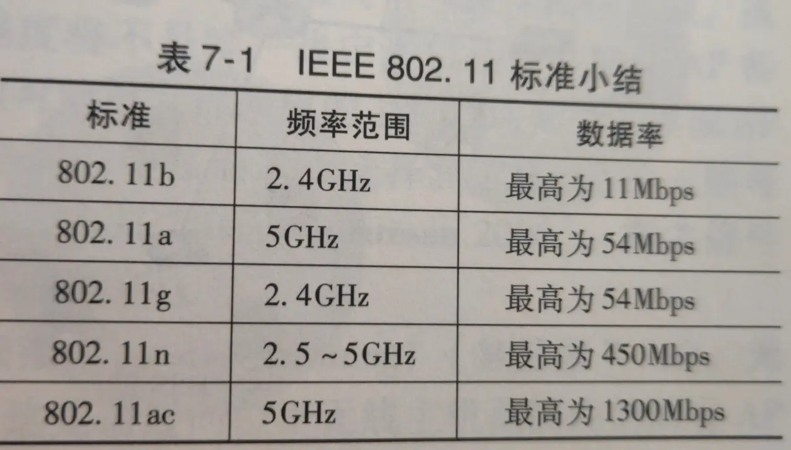
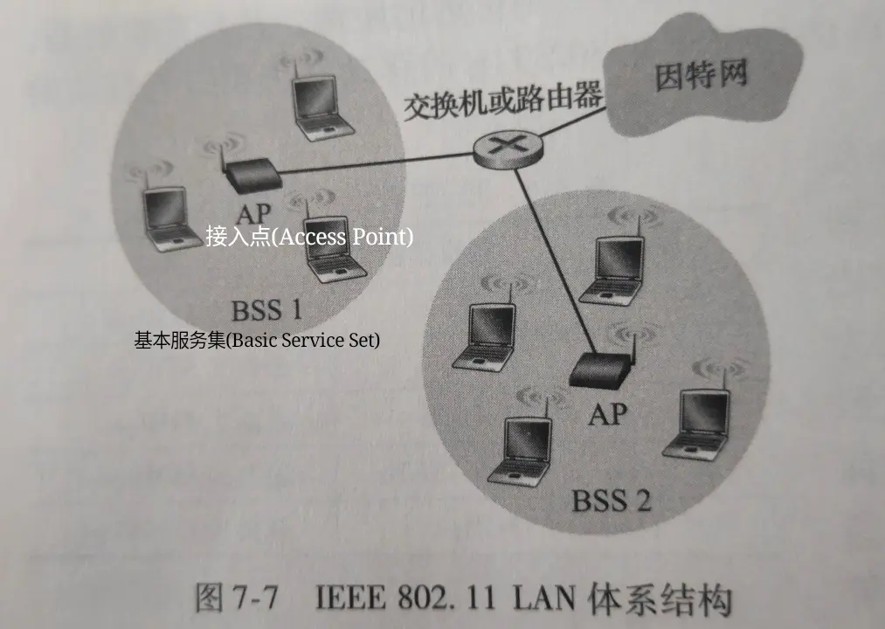
802.11 使用**带碰撞避免的 CSMA(CSMA with collision aviodance, CSMA/CA)协议**来协商多路访问

由于无线信道较好的比特差错率(BER)，802.11 使用**链路层确认/重传(ARQ)**。源站点监听到信道空闲，即等待**分布式帧间间隔(Distributed Inter-Frame Space, DIFS)**，然后发送帧；在目标站点收到 CRC 检验帧后，将等待**短帧间间隔(Short Inter-Frame Spacing, SIFS)**，然后发送一个确认帧。

在发送长数据时，源站点和目标站点会通过**请求发送(Request to Send, RTS)帧**/**允许发送(Clear to Send, CTS)帧**来避免碰撞
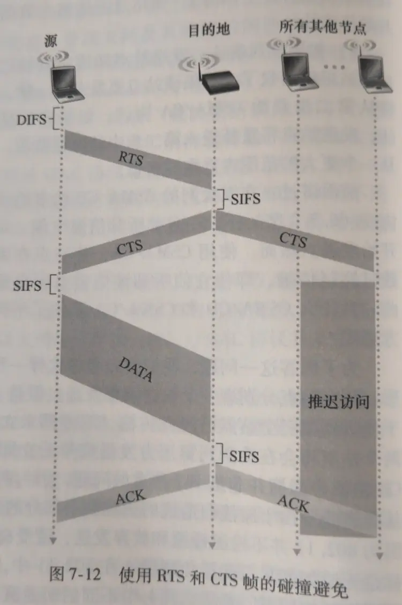
802.11 运行在 2.4~2.4835GHz 的频段中。其中有 11 个部分重叠的信道。当且仅当两个信道间隔 ≥4 时才无重叠，特别是 1/6/11 是唯一的 3 个非重叠信道集合

同以太网类似，每个 AP 接口和主机都有一个 6 字节的 MAC 地址，存储于 802.11 网络接口卡中

当安装一个 AP 时，需要分配一个单字或双字的**服务集标识符(Service Set Indentifier, SSID)**和一个信道号

接入 AP 的步骤

1. 每个 AP 周期性的发送**信标帧(beacon frame)**，无线主机也周期性扫描 11 个信道来确定周围的 AP。选择被动扫描或主动扫描来监听信标帧
2. 对用户鉴权。基于 MAC 地址或 AP 通过 RADIUS, DIAMETER 等协议与鉴权服务器通信
3. 接入后通过 AP 发送 DHCP 发现报文获取 IP 地址
   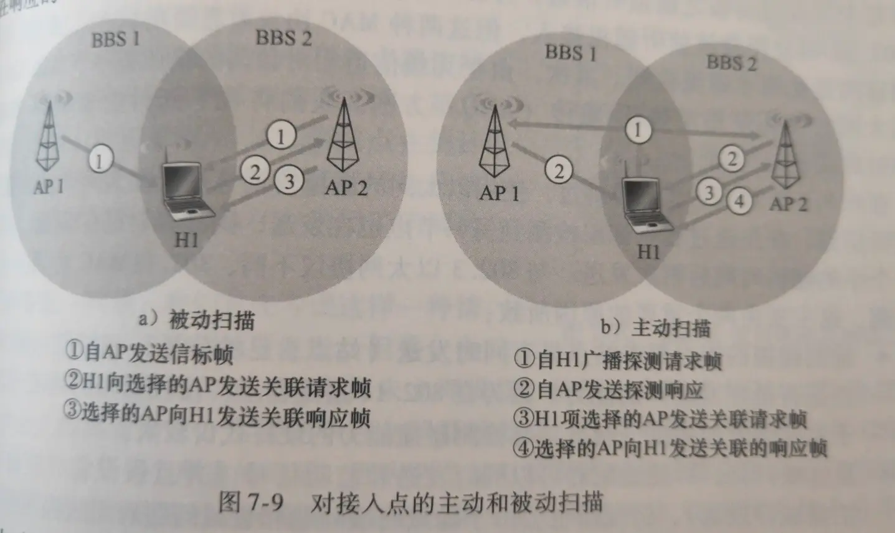
   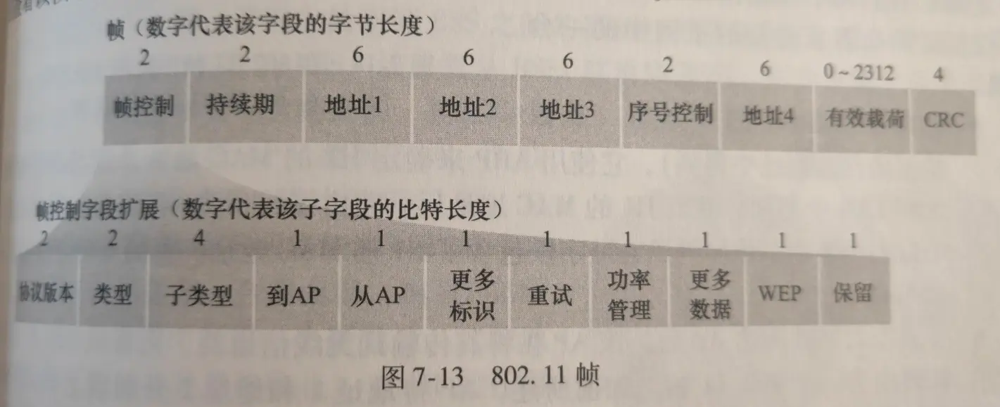

- 类型和子类型区分关联、RTS、CTS、ACK 和数据帧
- WEP 指示是否加密
- 持续期指 ETS/CTS 控制的持续时间
- 序号控制和运输层作用类似
- 地址 1 是接收的无线站点 MAC 地址，地址 2 是源站点 MAC 地址，地址 3 是路由器 MAC 地址，地址 4 是自组织模式互相转发时使用

## 蓝牙: 802.15.1

IEEE 802.15.1 网络有时被称为**无线个人域网络(Wireless Personal Area Network, WPAN)**，其链路层和物理层基于蓝牙规范

802.15.1 以 TDM 方式工作在 2.4GHz 无线电波段，每个时隙长度为 625μs

每个时隙内，发送端利用 79 个信道中的一个传输，并通过伪随机方式变更信道，该方式称为**跳频扩展频谱(Frequency-Hopping Spread Spectrum, FHSS)**

802.15.1 是自组织网络，其网络称为**皮可网(piconet)**。其将指定一个设备为主设备，其时钟确定了皮可网的时间

## ZigBee: 802.14.5

802.14.5 是用于低功率、低工作周期设备的 WPAN

ZigBee 以超帧工作，分为活跃周期(传输数据)和非活跃周期(保存能量)
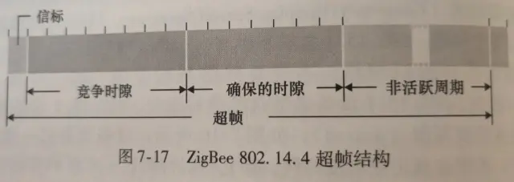

## 蜂窝网

其标准是**全球移动通信系统(Groupe Spécial Mobile, GSM)**
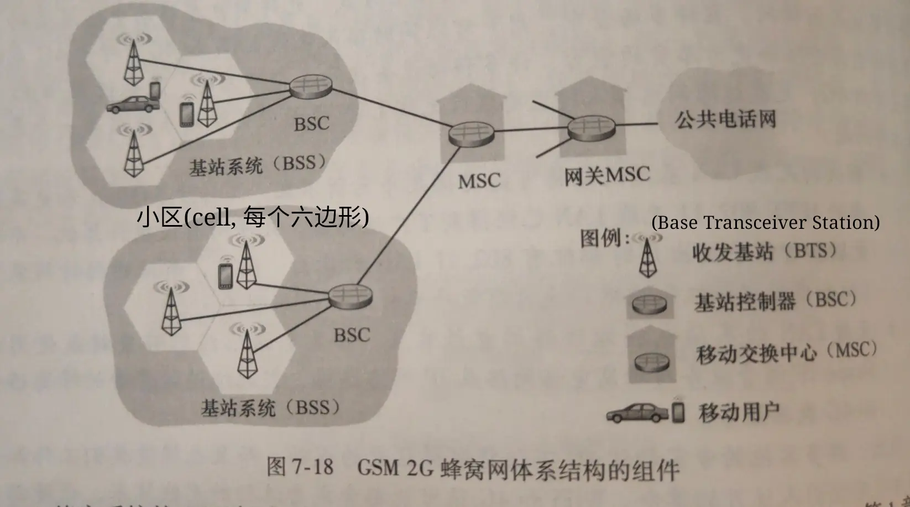
BSC 用于向用户分配 BTS 无线信道，执行**寻呼(paging)**(找出其所在小区)

MSC 负责用户鉴权、管理和呼叫的建立及切换

2G 使用组合的 FDM/TDM 来控制多路访问

从 2G 起，标准就不再统一。之后讨论基于第三代合作伙伴项目(3rd Generation Partnership Project, 3GPP)研发的通用移动通信服务(Universal Mobile Telecommunications Service, UMTS)的 3G 和 4G
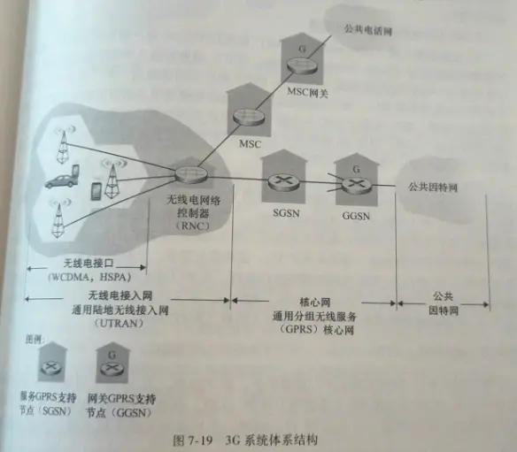

- SGSN 负责维护用户认证和切换，并提供交付/提供数据报服务
- GGSN 起到网关作用
- RNC 类似于 2G 的基站，既连接 MSC 与电路交换蜂窝语音网络连接，也通过 SGSN 与分组交换的因特网连接

在 TDM 时隙中(兼容 2G)，UMTS 使用**直接序列宽带 CDMA(Direct Sequence Wideband CDMA, DS-WCDMA)技术**提供多路访问，且配合**高速分组接入(High Speed Packet Access, HSPA)**传输数据
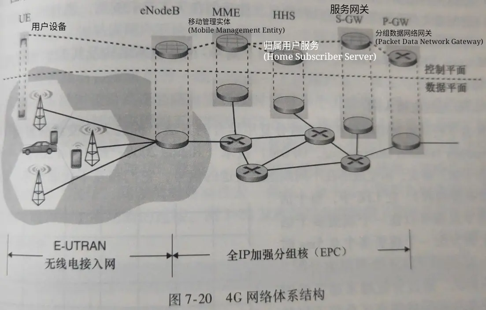

- eNodeB 类似于 3G 的 RNC。UE 的数据报在此封装，并通过 EPC 以隧道方式(类似于 IPv4-IPv6 隧道)传递给 P-GW
- P-GW 给 UE 分配 IP 地址，并保证服务质量(QoS)的实施
- S-GW 拦截流量和处理流量数据，并执行收费记账功能
- MME 执行连接和移动管理
- HSS 包含漫游、鉴权等服务

LTE 中，语音和数据都承载在 IP 数据报中

LTE 中使用**正交频分复用(Orthogonal Frequency Division Multiplexing, OFDM)技术**来处理多路访问

## 处理移动

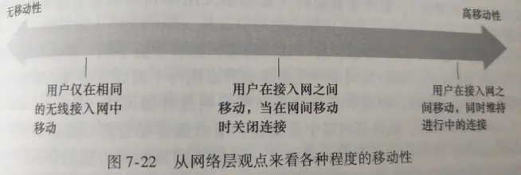
处于高移动性的用户使用移动 IP，其允许移动节点在网络移动时维持永久的 IP 地址

一个移动节点的永久居所被称为**归属网络(home network)**，在归属网络中代表移动节点执行移动管理功能的实体称为**归属代理(home agent)**

移动节点当前所在的网络叫**外部网络(foreign network, 或被访问网络(visited network))**，在外部网络中帮助移动节点做移动管理功能的实体称为**外部代理(foreign agent)**

外部代理 ① 为移动节点产生**转交地址(Care-Of Address, COA)**，COA 属于外部网络的一部分，② 和归属网络通信，使得归属代理维护移动节点本身地址(永久地址)
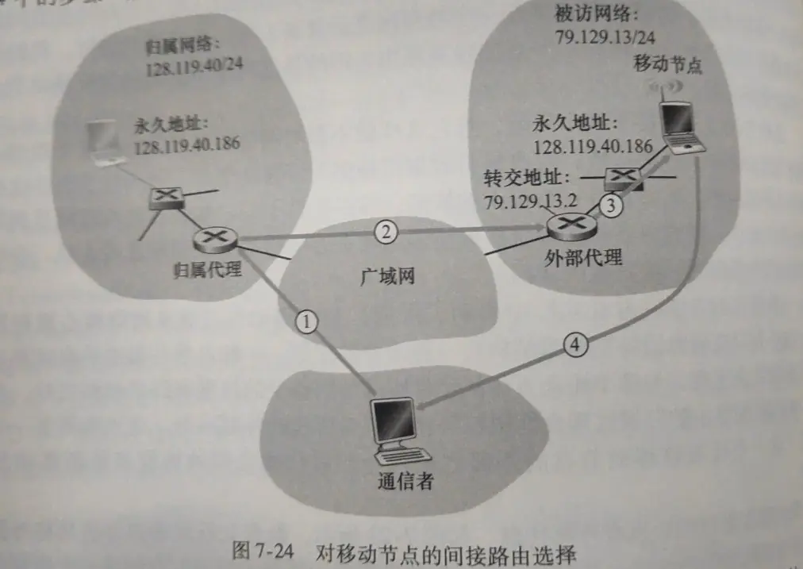

1. 通信者使用移动节点的永久地址作为目标地址寻址
2. 归属代理封装数据报，转发给外部代理
3. 外部代理将 COA 地址作为目标地址发送
4. 移动节点使用其永久地址发送至通信者

间接路由选择会产生**三角路由问题(triangle routing problem)**，导致运行低效
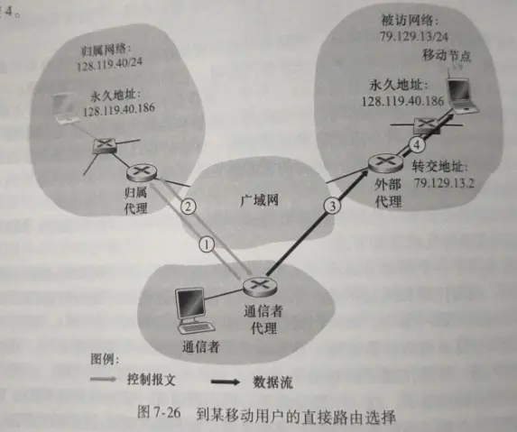
1.2. 通信者代理和归属代理交互，获取移动节点的 COA
3.4. 通信者使用获取到的 COA 直接和外部代理通信

直接路由选择会导致移动问题，但可以使用**锚外部代理(anchor foreign agent)**解决。在移动节点移动时(产生新代理和新 COA)，在步骤 3 时锚外部代理将重新和新代理之间交换新 COA，然后处理数据
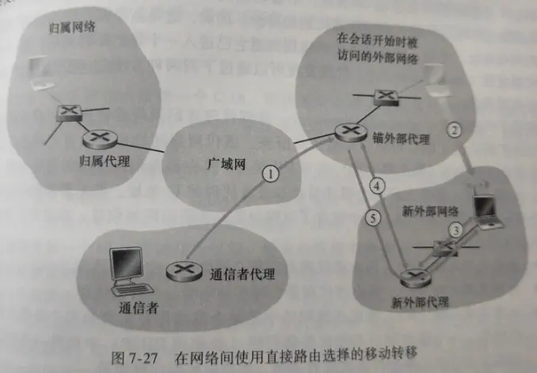
使移动节点中的网络层知道进入新的外部网络的过程称为**代理发现(agent discovery)**。其有两种方式实现：代理通告或代理请求

- **代理通告(agent advertisement)**使用现有的路由器发现协议的扩展协议(RFC 1256)来通告。代理周期性的在所有连接的链路上广播 ICMP 报文
  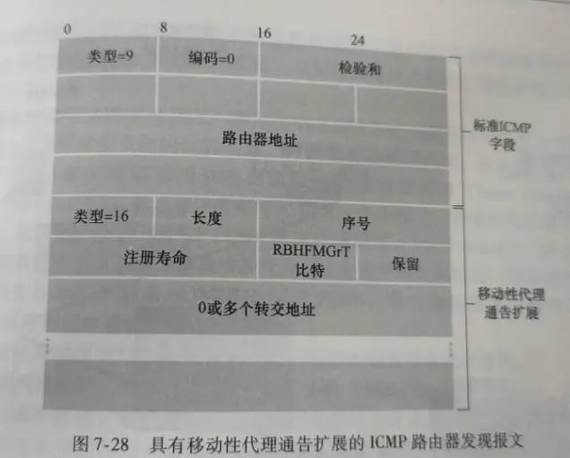
- **代理请求(agent solicitation)**中移动节点使用类型=10 的 ICMP 报文广播。代理收到广播后将单播一个代理通告

代理发现后移动节点还需要**代理注册**。其步骤为：移动节点向外部代理发送注册报文(UDP, 434)，外部代理向归属代理注册(UDP, 434)，归属代理鉴权，外部代理接收注册响应转发给移动节点
