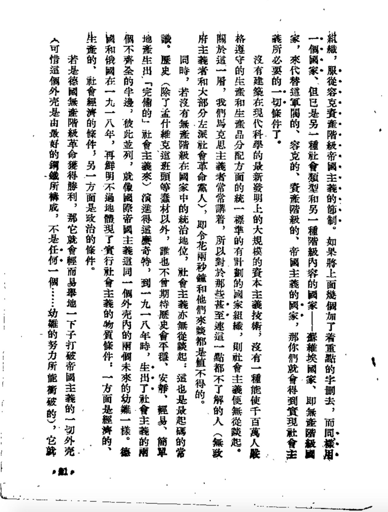

译自维基百科 [Accelerationism - Wikipedia](https://en.wikipedia.org/wiki/Accelerationism)
及 [Accelerationist Politics -Critical Legal Thinking](https://criticallegalthinking.com/2013/05/14/accelerate-manifesto-for-an-accelerationist-politics/)

## 简介

在政治和社会理论中，加速主义认为：现有的资本主义体系，或是具有它的历史特征的某些技术社会进程，应当被扩展、再利用或加速，以产生激进的社会变革。一些当代加速主义哲学以德勒兹-伽塔里的解构主义理论为起点，为了克服那些反对深远的社会变革可能性的保守倾向，意图于识别、加深和激进化“去畛域化”（deterritorialisation）的力量。加速主义也可以更宽泛指称支持资本主义的深化，认为这将加速其自我毁灭的倾向，最终导致资本主义的崩溃。

加速主义理论已经分为相互矛盾的左翼和右翼变形。“左翼加速主义”试图使“技术演进的过程”超越资本主义的有限视野，例如通过重新利用现代技术来达成对于社会有益和解放的结果; “右翼加速主义”支持资本主义本身的无限期的强化，可能是为了产生一个技术奇点。

## 背景

许多哲学家表现出明显的加速主义态度，包括卡尔·马克思在他 1848 年的“关于自由贸易问题的演说”：

保护关税制度在现今是保守的，而自由贸易制度却起着破坏的作用。自由贸易引起过去民族的瓦解，使无产阶级和资产阶级间的对立达到了顶点。总而言之，自由贸易制度加速了社会革命。先生们，也只有在这种革命意义上我才赞成自由贸易。

同样，弗里德里希尼采认为，“欧洲人的协调乃是不可阻挡的伟大过程，因为，人们本应加速这一过程。这样就会产生裂隙、距离和等级制。没有必要减缓这一过程”（译注：《权力意志》商务印书馆 91 年版 P234-235），像德勒兹和伽塔里一样，这个陈述经常被简化为一个“加速化”的命令。

## 当代加速主义

突出的理论家包括右翼加速主义者 Nick Land。网络文化研究单位（Cybernetic Culture Research Unit，Cybernetic 一词含义很广，有控制论和网络两个含义，某些加速主义者也的确热衷于控制论，但我目前仍译为网络）是华威大学从 1995 年到 2003 年的一个非官方研究单位，是左右翼加速主义思想的一个关键来源，Nick Land 是其成员之一。知名的当代左派加速主义者包括 Nick Srnicek 和 Alex Williams，他们写作了《加速主义政治宣言》。还有 Laboria Cuboniks 集体，他们撰写了《陌生女性主义：为了异化的政治》的宣言。

沿着加速主义路线，保罗·梅森在《后资本主义：我们的未来指南》等著作中，试图推测资本主义后的未来。他宣称，“就像 500 年前封建主义结束那样，资本主义被后资本主义取代的过程将会被外部冲击所加速，并且被新型人类的出现所形塑，它开始了。”他认为合作化生产的兴起最终将有助于资本主义的自我毁灭。

## 宣言

<strong>
ACCELERATE MANIFESTO for an Accelerationist Politics

一个加速主义者的政治主张——《加速主义宣言》

</strong>

 

### 01.INTRODUCTION: On the Conjunction

1.在 21 世纪 20 年代初，世界文明面临着一类全新而巨大的灾难，这一正在降临的的灾难，无情地嘲笑在民族国家创立时建立的一系列政策上的规范、准则和组织架构。这一灾难就是资本主义的兴起，二十世纪里前所未有的斗争。

2.（在这场斗争中），最具有意义的是全球环境系统的崩溃。随后，它将威胁到现有全球人类的持续性存在。即使这是对全体人类最严重的集体恐吓，一系列虽然微不足道、但却同样易导致社会动荡的问题依旧如影随形并且与之息息相关。最终，资源消耗殆尽，尤其是水资源和能源储备，这预示着将出现大规模的饥荒，将出现许多经济崩溃的典例，和全新的暴力冲突与冷战。持续的金融危机会令政府选择如同慢性死亡的紧缩政策，例如，社会福利系统的私有化，大范围的失业浪潮或者薪资的停滞不前。这些在生产工序上持续发展并壮大的自动化技术，包括所谓的“脑力劳动”，都是资本主义世俗化的证据。我们将无法维持现有的生活标准，甚至达不到以前发达国家的中产阶级的生活水平。

3.相比这些不断向我们加速而来的灾难之下，当今的政策正被逼入窘境。我们对于新思潮、与如何产生组织的模式的无能为力，这些都是对于直面、并最终化解这场灾难所必需进行的社会转型的重要部分。当资本主义的力量与速度、政策的凋敝和不作为，都被囊括入这场危机中，基于这个已经瘫痪政治体系的巨大泡沫，人类的未来也不过是一个不可及的幻想罢了。

4.自从 1979 年以来，在霸权主义下，全球政治的意识形态已经在许多经济大国内变异为新自由主义，尽管新的全球问题向它呈递了深层次的结构性挑战。尤其是自 2007 年至 2008 年，这立即体现在贷款、金融和财政危机上了。新自由主义的措施和方案只能在不断深化中得到推进。这种新自由主义的延续，或是称作“新自由主义 2.0”，已经正在寻求新一轮结构上的调整，其主要通过鼓励私有成分发起更猛烈的攻势，去进攻社会民主主义制度与之体系的残余部分和力量。即使这会立刻带来政策上的、关乎经济、社会的负面影响，并且会造成由新全球危机带来的长期、根本性障碍。

5.这就是右翼政府势力与民间的势力，不仅如此，资本的力量已经能够向新自由主义施加压力，至少从某种程度上，这恰恰是左翼残存力量的持续瘫痪、不作为行为的恶果。30 年来，新自由主义丝毫没有向左翼政党灌输激进与进步的思想，这些政党名存实亡，更没有得到人民的拥护和支持。他们（指新自由主义者）对于现有的危机，最多只能呼吁我们回到凯恩斯主义经济，尽管证据早已证明了战后重启、复兴社会民主主义的特殊条件已不再存在，就算可能，我们也不能下令重新成为福特主义大工业模式下的工党。即使是南美洲玻利瓦尔革命的“新社会主义者”的政治制度。同时令人振奋的是他们反抗同时期资本主义教条的卓越能力，剩下的只有对无力推进 20 世纪中叶后幸存的社会主义事业发展的失落和遗憾。工会力量，被新自由主义“杰作”所做出的改造系统地消减了，它在制度层面已经僵化了，这些充其量只能在轻微缓和新结构调整的力度时适用。但是我们没有建设一个新经济制度整体性、系统性尝试，或是从上至下大家团结一致，推动一系列这样的变革，因为当下劳动力的过剩还是较为乏力的。西方社会的“**新社会运动**”，自冷战结束后开始出现，在 2008 年金融危机后复苏并且崛起，同样也不能创造出一种全新的政治思潮视野。相反，他们在国内的直接民主程序上，和情感上的“自我价值稳定”上，积蓄了相当大的力量。并且他们经常提出一大堆新原始主义者的地方主义变型，就好像用羸弱不堪、朝生暮死的，所谓“公众面前的真实”去反对抽象的资本主义全球化的暴虐。

6.在缺乏一个全新的社会层面、政治层面、组织层面和经济层面的视角的情况下，右翼的霸权主义国家将持续做着狭隘而不切实际的春秋大梦，所有的证据无一不佐证了这一点。面对最坏的结果和最猛烈的攻击，左派人士只能零星地招架，困兽犹斗，负隅顽抗。但是这就如同**英格兰丹麦籍国王卡努特在潮汐的力量面前螳臂当车的行为** 一样，最终是根本无法抵抗的。为了形成一个新右派的全球霸权主义，必然需要、也的确需要拯救我们已经希望渺茫的未来。

### 02. INTERREGNUM: On Accelerationisms

1.如果存在任何一种能与加速主义观点相联系的系统或者制度， 那毫无疑问是资本主义。资本主义最基本的新陈代谢规律，需要通过个体资本家的竞争与搏杀来促进经济增长。（个体资本家们）调动起实体物质，以促进科技的进步，从而试图在竞争中获取更大的竞争力，但这一切始终伴随着社会进步的脱节问题。在新自由主义体系内，这种意识形态的自我表现，只是约瑟夫·熊彼特提出的“**创造性毁灭**”这一经济理论力量的释放罢了，只是不断加速进步的科学技术和社会创新的解放罢了。

2.哲学家尼克·兰德（短篇恐怖小说家、加速主义的提出者）敏锐而正确地捕获了这一点，他坚信，就短期而言，资本家自身的“速度”能促进一个全球性的转变，从而转变达到一个前所未有的“科技奇异点”。通过他的这个视角去看待资本主义，那么人类最终将被遗弃。就像是一个步履蹒跚、被生拉硬拽前进的老人，相比于一整个星球的飞速发展一般，而这种抽象的飞速发展，由许多过往的文明拼凑在一起的。但是，尼克·兰德的新自由主义思想混淆了**速度(speed)和加速度(acceleration)的概念**。即是，我们的资本主义可能的确在飞速前进，但这仅仅是在某些严格定义的环境之中——这个环境使得那些资本家们的地位丝毫不动摇。我们仅仅感受到了这条水平线上升的速率，就像是一个白痴一般横冲直撞，却不知道加速度能够指引我们的方向，当然这只是在许多可能性中的一种实验方案。这是我们必不可少的、另一种模式下的加速主义。

3.更糟糕的是，就像**德勒兹（Gilles Deleuze）和加塔里（Pierre-Félix Guattari）**所认知的那样，资本家们自一开始就一边急于**解辖域化**（生产变化的运动，通过逃逸离开旧有环境进入全新领域，通过创造出新的环境发掘自身的潜能），一边急于再辖域化。在剩余价值框架、过剩的劳动力和不受约束的资本中，进步被抑制了。现代化程度的降低，可以归纳为经济增长的统计数字，与相比我们曾拥有的公有制社会、和现在的媚俗产物。撒切尔夫人的新自由主义改革与里根总统的政策也遥相呼应，紧紧围绕在维多利亚式的“**回归本始**”和宗教的价值观旁。

4.令人紧张的是，对于新自由主义，它是以一个“现代工具”来描述其形象的，这大致与“现代化”相同，意味着他们得到了一个关乎未来的不可能的保证。确实，就像新自由主义发展的那样，它更倾向于用消灭认知视角下的创造力，来替代一条高效却死板、与国际供应链和西方新福特主义生产区相联系的生产线，而不是消灭个人的创新能力。每年都有一小撮工人中的优秀知识分子脱离这个群体，并且这个人数呈上升趋势，因为从算法上来说，自动化技术会成为更优秀、更聪慧的劳动力。新自由主义，即使它自以为是一个历史性的必要进步，实际上它只是为了避开 20 世纪 70 年代出现的价值危机的缓兵之计。新自由主义最终并没有克服它，而是不可避免地呈递、并加剧了这场危机。

5.同马克思坚定地站在一切的是尼克·兰德，一位杰出的加速主义思想家。与那些司空见惯的批判相反，甚至与某些同时期的马克思主义者的态度相反，我们必须记住，马克思本人曾运用了最先进的理论工具和实验数据去充分了解、并且改变这个世界。他不是一个反对现代化的思想家，而是一个想试图分析研究，并介入其中的人。他理解了对于现代化过程中的一切剥削、腐败的行为，理解了迄今为止，资本主义依然留下了最先进的经济体系。现代化的成就没有被推翻，而是加速、冲破了资本主义价值观所设立的“枷锁”、“壁垒”。

6.实际上，正如 1918 年列宁同志在《论“左派”幼稚性和小资产阶级性》（译者注：与《共产主义运动中的“左派”幼稚病》不是一篇文章）中所说的那样：

> “没有建筑在现代科学最新成就基础上的大资本主义技术，没有一个使千百万人在产品的生产和分配中严格遵守统一标准的有计划的国家组织，社会主义就无从设想。我们马克思主义者从来都是这么说的，而对那些甚至连这点都不了解的人（无政府主义者和至少半数的左派社会革命党人）是不值得多费唇舌的。”

7.正如马克思所觉察到的那样，资本主义不能被认作为“加速”的代表。相同地，左派政治家们作出的关于反对技术社会的加速的评价，至少一部分是严重地歪曲事实。事实上，如果左派政治家们能拥有一个未来，那么一定是最大限度地信奉这个当今被打压的加速主义的未来。

### 03. MANIFEST：On the Future

1.我们认为在当今左派中最严重的分歧在于那些坚持民族主义的政治的人，认为应当采取罢工、游行等直接行动的人，无休无止的**水平主义**，以及那些被称作“加速主义政策”的纲领与抽象的、复杂的、全球化的、和技术化的现代完美相容。前者依然沉浸于为非资本主义的社会关系建立狭小与临时的栖息地，却避开了问题，即所面对的敌人是非局部的、抽象的、且扎根于我们的平常生活、基础设施中的。从内在来说，这些政策是从一开始就注定失败的。相比之下，加速主义者的政治主张则试图保护晚期资本主义社会的成果，以用来在其基础之上建立更优的价值体系，推行更完善的规制结构，并且更多的冲突矛盾将被解决。

2.我们每一个人无疑都希望减少工作。对于战后世界上一些著名经济学家坚信一个文明、进步的资本主义必然会朝着激进地减免工作时间的方向进步，这的确是一个有趣的问题。在 **《我们子孙后代的经济前景》**这一篇论文（写于 1930 年）中，凯恩斯预言了一个资本主义的未来，在那里每一个人都能将工作时间减少到每日三小时。而正好恰恰相反发生的是，工作与生活之间界限的逐渐消除，伴随着工作逐渐渗透到新兴的“**社会工厂**”的每一个方面。

3.资本主义已经开始强迫科学生产力，即便最仁慈地，也是将它们引导向一个本不必要的、难以脱身的窘境。资本主义的专利战和知识产权垄断已经成为了当下的大环境，同时表明了资本的需求已经超越了合理竞争本身，并且资本正在向对技术的依赖加速倒退。新自由主义适当加速的结果并没有使人们的工作量和压力减小。我们正生活在一个除了仅仅某些消费者的小物件正稍微发展，而其余事物，如同宇宙航行、“未来冲击”或技术革命的潜力，毫无进展的时代。无穷无尽的维持边缘消费者需求的基础物质产品循环，建立在人类社会加速的累累尸骨上。

4.我们不希望回到福特主义，我们也不可能回到福特主义。资本家的黄金时期是基于有条不紊的工厂环境的生产范式的。在这种工厂环境下，作为乏味且无聊的、始终受到社会打压的一生的回报，（男）工人的安全至少得到了保障，基础的生活水平的需求至少得到了满足。这样的一个系统，依赖于一个由殖民地、帝国与欠发达的边远地区构成的国际等级制度，依赖于一个由种族主义与性别歧视构成的国家等级制度，以及依赖于一个由男权构成的家庭等级制度。许多人可能会认为这些都是守旧与倒退的，这种制度是不得人心的，是几乎不可能回来的。

5.加速主义者想要打破极具潜力的生产力的枷锁。在这个任务中，新自由主义的物质平台并不需要被摧毁，它需要被重新改造，变成大众的需求；剩余的基础设施不再作为一个需要被彻底粉碎的资本家的平台，而将作为朝晚期资本主义前进的跳板。

6.资本家的目标被套上了**技性科学**的枷锁（尤其是自上世纪 70 年代以来），我们确实到目前为止还不知道现代的技术性社会体系能有什么作用。可是我们之中又有谁能完全认识到那些已经被开发技术中蕴藏的、未被开发的潜力呢？我们以那些还未被开发利用的科学技术研究作为赌注。而这些研究目前充斥着冗余的属性（或者预适应），带来了能起到决定性作用的、超越资本家们鼠目寸光的改造。

7.我们想要加速科学技术发展的进程。但是我们正在努力争取的不是技术乌托邦主义，永远不要相信单单凭科学技术就足以拯救我们。是的，它的确是重要的，但是如果抛开了社会政治的作用，那么它还远远不够。科学技术和社会与彼此都是紧密联系的，并且其中一方的增强势必影响另一方。鉴于技术乌托邦主义者为加速主义作争取的依据是，加速主义会自主地解决社会冲突问题，而我们的定位是，科学技术应当被严谨地加速发展，因为这是赢得社会冲突、矛盾的需要。

8.我们坚信，任何晚期资本主义社会都需要晚期资本家的精心设计。而这种观点是在这么一种想法下竖立的，即，在一场革命发生后，人们会自发地组建一个全新的社会经济系统（并不是简单地回到资本主义，这说得好听是天真，说得难听是愚蠢）。为了推进它，我们必须拥有一张现有经济系统和对未来经济系统投机的构想的认知图。

9.这样做的话，左翼必须将所有资本主义社会科学技术上的发展可能利用起来。我们宣称，量化并不是一个要被消灭的恶魔，而是一个需要在最具效率的可能方法中被利用的工具。经济模型，简单来说，是创造复杂却明晰的世界的必需。2008 年的金融危机揭示了盲目接受、坚信数学建模的危险，直到目前为止还是一个不合逻辑的结论，而问题不出在数学其本身。这些分析社会网络中发现的工具，形如代理人基模型，大数据分析与非均衡的经济模型，都是理解像现代经济这种复杂系统的认知媒介。左翼加速主义者必须成为这些技术领域的认同者、学习者。

10.任何社会转型必须包括经济和社会实验。**智利赛博协同工程**就是这种实验性观点的典例——融合了先进的**控制论**科技与复杂的经济模型，以及在自身科技基础设施上具化的民主背景。上世纪 50 年代至 60 年代的苏联也曾运用了相似的经济模式，利用控制论和线性规划的方法，试图克服先行共产主义经济带来的种种问题。上述的这些最终都失败了，其原因可以归结为，在这些早期控制论专家的领导下，政治和科学技术都受到了约束。

11.左翼必须加强对社会技术的领导能力、控制能力，不仅在思想领域上，而且要在物质平台上。物质平台是全球社会的基础，它决定了在行为角度和意识形态方面，是否有可能的基本限制因素。从这个意义上来说，他们体现了社会的物质上的先验性：使执行、联系与权力成为一个整体变为了可能。当大多数现存的全球平台对资本主义社会关系存在偏见，它却不是这样的必然。这些生产力的、金融的、组织的上、以及消费上的物质平台将向着晚期资本主义的方向，被重新改编、重新组合。

12.我们不相信直接行动（如同罢工、游行示威）有足够的力量达成它们中的任何一种情况。这些惯用手法的风险，例如，游行示威，高举口号标语，或建立一个临时自治区，越来越变为了成功的有效安慰型替代品。“至少我们努力过”这句话，也变成了那些自尊自大的人所谓的“战斗口号”，而不是实实在在有显著作用的行动。一个方法是否有成效，其唯一的评判标准是它是否能带来显著的成功。我们必须追捧对于某些行动的剑走偏锋。政治必须被当作一整套的动力系统，包括那些因矛盾冲突而支离破碎的，包括不断的适应与不断的拮抗，包括战略军备竞赛。这意味着每一种独立的政治行动，当其拮抗的一面逐渐适应环境，其自身会变得越来越迟钝与低效。没有任何一种历史上的政治行动是一成不变的。实际上随着时间的推移，当力量和实体被聚集起来以对抗他们，我们越来越需要抛弃那些为人熟知的套路手法。这就是当今左翼对于消极懈怠的核心问题，却束手无策的部分原因。

13.所谓“民主进程”高于一切的特权必须被舍弃，例如对于所谓“开放”、“水平主义”、以及当今大部分极左设立的毫无作用的“包容主义”的盲目崇拜。同时，“保守”，“垂直主义”，“排外主义”也应当在有效的政治行动中有其自己的地位。

14.“民主”不应被其字面义简单地定义，例如不通过投票、讨论、大会的形式。真正的民主应当被其最终的目的定义，例如集体对自身的控制。民主是紧密结合政治与法国启蒙运动遗产的成果。推广来说，它只能通过我们增强对于我们自身与这个世界的理解（我们社会、技术、经济、哲学融为一体的世界），那样我们才能规范自身。除了那种以水平形式分配的社会，我们需要假想一个全体人民共同控制的、合法的、由上至下垂直管理的权利系统，以避免成为专制的、中央集权制的奴隶，或是经常发生超出我们控制范围的事件。我们计划的命令必须与来自网络系统的简易指令相联系。

15.我们并不是说通过任何一个特殊的组织都能成为传达这些指令的理想手段。那些被需要的，而且是通常被需要的，是组织上的“生态学”，是力量的多元化，是他们优势对比的共鸣与反馈。宗派主义是左派的丧钟，其破坏力如同集权一般，并且在这方面我们继续欢迎进行不同的方案的实验（即便我们反对这些方案）。

16.我们有三个中期的具体目标。第一，我们需要建立智能的基础设施。模仿新自由主义的改革——**朝圣山学社**，其任务就是创造一个全新的意识形态，经济与社会的模型，以及一个代替并超越如今控制世界的、苍白无力的思想的视角。对于基础建设，我们需要的不仅是思想上的建设，更是制度和具体路线的反复灌输，使它们具体化并广为传播。

17.第二，我们需要进行一个大规模的媒体业改革。尽管由互联网与社交媒体提供了表面上的“民主化”，在言论的选择与框架方面，以及拥有从事调查性报导的资本的方面，传统媒体仍然是至关重要的。令这些形式尽可能地受民众控制，这对于彻底摧毁现在事态现象同样是至关重要的。

18.最后，我们需要重组各种形式的阶级政权。这样的重组必须超越一种概念，即“一个有机形成的全球无产阶级已经存在了”。相反，它必须试图将来自全球各地、互不相同的无产阶级紧紧地团结在一起，这在劳动力不稳定的后福特主义形式中常常体现。

19.组织与个人都已经投入了达到这三点目标的工作中，但是仅仅达成其中的一个是不够的。我们需要的是三点都达成后，互相之间有正反馈的作用，当其中任意一点作了些许修饰，三者的同期联合令剩下的两点也越来越高效。一个由基础结构的、意识形态的、社会与经济的改造构成的环形正反馈结构，形成了一个全新而复杂的领导体系，一个全新的晚期资本主义技性社会平台。历史证明了那些带来系统性变革的策略与团体总是来自广泛的联合，我们必须知道这些。

20.为了达到每一个目标，在实际水平上我们认为，左翼加速主义者必须对建设一个全新而有效的政治基础所需要的资源与金钱的流动有更加严谨的思考。不仅仅是满大街的“人民的力量”这一句空洞的口号，我们需要基金，无论是来自政府的、研究机构的、智库的、工会的、或是个体的捐赠者。我们认为这些基金流动的定位与传递，是重建高效左翼加速主义组织的环境的基本要素。

21.我们申明，只有对社会与之环境的最大掌控的独创性政治，才能够解决全球性问题与取得在资本主义上的胜利。这种“掌控”必须同被原始启蒙运动的受人喜爱的思想家们划清界限。**皮埃尔-西蒙·拉普拉斯的机械宇宙**，轻而易举地掌握了足够的信息，早已远离了严谨的科学认知。但是这不是将我们自身与后现代主义残渣联合，将这种“掌控”比作**原法西斯**或者权力以赋予其原罪。相反，我们认为那些对我们的星球和生物有害的问题，迫使我们将这种“掌控”重新粉刷为一个全新而复杂的形象。虽然我们不能预测我们行动的精确结果，但是我们可以确定一个结果的概率区间。新形式的行动必须与这样一个复杂的系统分析相联系：通过处理突发事件以训练执行突发性计划的能力，这仅在地缘政治的社会和对于狡猾措施的行事中才能得以体现。一个溯因实验的建立是在这个复杂的世界中行事的最好途径。

22.我们需要复兴那些习惯上关于晚期资本主义社会的说法：资本主义不只是不公正的、扭曲的社会系统，更是阻碍社会进步的系统。我们技术的进步正被资本主义压制，就如同它曾经被资本主义解放一般。我们应当打破资本主义社会套在技术上的枷锁，释放技术带来的巨大能量，这就是加速主义基本的信仰。那些为了打破附加在我们身上的禁锢的运动，一定不只是“为了更加理性的全球社会”的斗争。我们相信，它一定包含了复兴那些贯穿 19 世纪中叶至新自由主义时代晚期的梦想，甚至可以追溯至那些远古智人想要摆脱地球的束缚以直立行走的追求。这些观点如今看来是天真时代(The Age of Innocence)的遗留，现在它们都被认作是我们时代想象力的严重匮乏，并且被视为是前途光明的、知识高度活跃的未来的有效保障。但这毕竟只是由加速主义者的政策达成的晚期资本主义社会，它将为**20 世纪中叶的载人航天工程**注入源源不断的资金，从而超越我们当前微不足道的技术升级，达到一个包罗万象的改革，向着一个由集体自身掌控的时代前进，向着我们需要的、可能的、陌生而正确的未来前进，向着自我批评、自我掌控的启蒙运动的最终实现前进，而不是使这一切付诸东流。

23.我们面临着严峻的选择：不是全球化的晚期资本主义，就是原始主义逐渐的分崩离析，周而复始的危机，以及全球生态的崩溃。

24.我们需要构建我们的未来。它现在已经被新自由资本主义完全摧毁了，变成了更严重的不平等、矛盾与冲突、混乱不堪等问题的廉价承诺。未来世界的崩溃问题要归结于当代历史地位的倒退，而不是如同政治光谱上的犬儒主义者们试图让我们相信的，一个成熟度都存疑的标志。加速主义努力推进的正是一个更现代的未来——一个新自由主义者天生就不能达成的现代性。未来必须被再次大刀阔斧地改造以至豁然开朗，开阔我们的眼界，向着外面世界的无限可能不断前进！

译者注：

<ol>

<li>
  新社会运动(New social
  movements)是一个试图用来解释在众多西方国家社会中自20世纪60年代中期的新运动数量过多的理论，这些新运动宣称要远离传统的社会运动模式。而新社会运动理论分为两个中心要点。第一，后工业化经济的兴起是形成新社会运动浪潮的原因；第二，这些运动明显与以往的工业化经济的社会运动不同。最基本的不同是其目的不同，新运动不再注重唯物主义的种种特点，如经济福利之类的，而是更加注重人们的权利（如男同性恋与反战思想）。
</li>

<li>
  英格兰丹麦籍国王卡努特在潮汐的力量面前螳臂当车的行为：源自英格兰丹麦籍国王的故事。据说他临海而立，向民众现实他没有能力命令冲向陆地的海水回头。（来源牛津词典）
</li>

<li><a href="https://en.wikipedia.org/wiki/Creative_destruction#cite_note-Schumpeter1942_2-2">创造性毁灭</a>：于20世纪50年代由澳裔美国籍经济学家约瑟夫·熊彼特最终确立，这一经济学概念源自于卡尔·马克思，并且作为经济创新与经济周期的一大理论。

> 根据熊彼特的理论，“创造性毁灭风暴”指“产业突变的过程不断使经济结构从内部发生变革，这一变革不断摧毁旧有的结构，并不断建立新的结构。”在马克思主义经济学原理中，这一概念涉及了资本主义下的资本、财富的积累和毁灭中更广泛的联系。

<i>
Marx, Karl; Engels, Friedrich (2002) [1848]. The Communist Manifesto. Moore, Samuel (trans. 1888). Harmondsworth, UK: Penguin. p. 226. ISBN 0-14-044757-1. Retrieved 2010-11-07.

Marx, Karl (1993) [1857]. Grundrisse: Foundations of the Critique of Political Economy (rough draft). Nicolaus, Martin (trans. 1973). Harmondsworth, UK: Penguin. p. 750. ISBN 0-14-044575-7. Retrieved 2010-11-07.

Marx, Karl (1969) [1863]. Theories of Surplus-Value: "Volume IV" of Capital. 2. London: Lawrence & Wishart. pp. 495–96. Retrieved 2010-11-10.

</i>
</li>

<li><a href="https://en.wikipedia.org/wiki/Gilles_Deleuze">德勒兹(Gilles Deleuze, 1925.1.18-1995.11.4)</a>，法国哲学家，自上世纪60年代至去世专注于哲学、文学、电影和美术。他的最著名的作品《反俄狄浦斯》(&#x3C;Capitalism and Schizophrenia: Anti-Oedipus&#x3E;, 1972)和《千座高原》(&#x3C;A Thousand Plateaus&#x3E;, 1980) ，都是与加塔里合作完成。他的工作对众多学科产生了巨大的影响，从哲学横跨至艺术，包括文学理论，后结构主义和后现代主义。

[加塔里(Pierre-Félix Guattari, 1930.4.30-1992.8.29)](https://en.wikipedia.org/wiki/F%C3%A9lix_Guattari)，法国精神治疗医生，哲学家，符号学家与活动家。他创立了精神分裂症分析与生态哲学。

</li>

<li>“解辖域化”：篠原资明称之为“脱领土化运动”，夏光称之为“非地域化”。

在《反俄狄浦斯》中，德勒兹和加塔里认为解辖域化湿在符合社会发展趋势的行动中创造出来的即将揭开的未知世界。解辖域化是符合自然和社会发展规律的行为，这一运动指向的是一个不为人知的世界，一个即将被创造出来的崭新世界。

在《卡夫卡：走向一种少数人的文学》中，他们认为解辖域化是一条逃逸路线，主体通过它不仅自身能够逃逸，而且可以彻底与过去脱节，实现个性解放。解辖域化强调一条逃逸线，强调脱胎换骨的质变。

在《千座高原》中，他们认为解辖域化是锋刃，解辖域化就是勇往直前、不断开拓、永无止境的过程。

在《什么是哲学？》中，他们认为解辖域化可以是身体上的或物质上的，也可以是心理上的或精神上的。这就是说，解辖域化既可以是地理位置的变化，也可以是心理状态的改变，既可以是物质的变化，也可以是精神的改变。

</li>

<li>“回归本始”(Back-to-Basics)，是英国首相约翰·梅杰在1993年于黑泽召开的保守党大会上提出的政治口号。

> “……The message from this conference is clear and simple, we must go back to basics. We want our children to be taught the best, our public services to give the best, our British industry to be the best and the Conservative Party will lead the country back to those basic rights across the board. Sound money, free trade, traditional teaching, respect for the family and respect for the law. And above all, we will lead a new campaign to defeat the cancer that is crime.”

</li>

<li><a href="https://en.wikipedia.org/wiki/Horizontalism">水平主义</a>：

> Horizontalism is an approach to money creation theory pioneered by Basil Moore which states that private bank reserves are not managed by central banks. Instead reserves will be provided on demand at the bank rate set by the central bank. This inverts the mainstream textbook money multiplier relationship between deposits and loans since loans are said to cause deposits which in turn cause reserves. Horizontalism influenced monetary circuit theorists to develop the endogenous money approach that was already nascent within Post-Keynesian academic thought. It states that an increasing demand for loans by bank customers leads to banks making more loans and creating more deposits, without regard to the size of the bank's available reserves. Thus credit money created by private banks can be seen to be leveraging of those reserves without the guidance of a particular leverage ratio, i.e. horizontal leveraging.

水平主义构成后凯恩斯货币供给理论的基础，结构主义不是否认水平主义的基本思想，而是补充和发展了水平主义的静态分析方法。

> 水平主义认为，流动性偏好依赖于货币供给的外生性假设，这与信用货币供给内生性思想不相容，因此凯恩斯的流动性偏好和对货币需求的利率弹性分析不再重要了。而结构主义认为在信用货币循环和利率决定过程中流动性偏好仍然是直接影响因素。对货币存量的讨论不能抛开居民的流动性偏好和资产组合选择因素，它们会直接影响企业和居民愿意持有的货币存量，进而影响信用货币的创造数量。因此，水平主义只是描述了货币供给的流量特征，流动性偏好会通过影响货币需求进而影响货币供给存量的变化，在长期里货币供给存量曲线既可能是水平的，也可能是正斜率的。

_P.ARESTIS, P. HOWELLS. Theoretical Reflection on Endogenous Money: the Problem with Convenience Lending[J]. Cambridge Journal of Economics, 1996, (20):539-551_

</li>

<li>
  《我们子孙后代的经济前景》(&#x3C;Economic Prospects for Our
  Grandchildren&#x3E;)，有译作《我们后代在经济上的可能前景》，由著名经济学家凯恩斯著于1930年。
</li>

<li>
  Social
  factory，社会工厂，这一概念由20世纪60年代的意大利到自主论马克思主义提出，用来探究资本主义社会关系是如何从生产渗透到整个社会的。
</li>

<li>
  技性科学(technoscience)指全球长期存在的、并结合最新的科学方法的人类技术活动，其主要发生在17至18世纪的欧洲。包括了人类历史上技术的运用与现代科学工具，从为打猎（如弓箭）、农业（如犁）、畜牧业（如马具）等早期基础技术的发展，至整个原子能技术、生物技术、机器人技术、计算机科学的应用。
</li>

<li>智利赛博协同工程(Chilean Project Cybersyn)：是萨尔瓦多·阿连德总统在1971-1973年间智利的一项决策支持系统，智利全国的经济数据经由电传机网络汇聚于首都圣地亚哥的一间操作室，作为经济战争的指挥中心。

它的创造者预计，政府的工业管理者将根据国家经济活动的实时数据和宏观试图做出快速决策，进而通往对整个社会主义国家生产生活的民主管理。专家们认为赛博协同系统有助于政府做出快速、明智的决策，预测未来的经济表现，并消除反革命危机。随着项目的进展，团队成员们发现赛博协同不仅具备改善管理效率的功能，而且可以作为一种技术中介来实施符合智利社会主义理想的组织方式。

> 智利赛博协同工程，并不是停留在空想中的乌托邦理念，而是在二十世纪历史中真实存在过的，由政治行动所激发的对革命性未来的实践探求。这段历史表明，政治意识形态不仅表达了一种世界观，而且有助于新技术的设计和应用，来重新配置国家权力。它的历史还突出了战后自然科学和政治思想脉络中的相似理念，以及这种共享的知识结构如何将控制论原理和社会主义原则结合在一起。 一九七三年九月十一日清晨，皮诺切特的部队在北部城市瓦尔帕莱索(Valparaíso)发动了颠覆阿连德的军事政变。随着消息传入圣地亚哥，赛博协同中央指挥部的同志开始焚毁项目的程序磁带。赛博协同工程具备通往自由和奴役的双重可能，他们必须防止它落入错误的人手中。

</li>

<li>控制论(cybernetics)：一门试图构建生物、机器和社会系统之间共性的战后通信和控制科学。

[2017，王洪喆，《阿连德的大数据乌托邦 ——智利互联网考古》](http://www.wyzxwk.com/Article/lishi/2017/03/377730.html)

</li>

<li><a href="https://www.montpelerin.org/">朝圣山学社(The Mont Pelerin Society)</a>&<a href="https://zh.wikipedia.org/wiki/朝圣山学社">Wiki</a>：由弗里德里克·哈耶克(Friedrich August von Hayek)于1947年4月10日创立。这是一群觉察到文明社会的危机的人组成的国际性学术组织，为了其目的作出陈述性概述。他们发现自从第二次世界大战后，某些国家经济和政治上的自由主义正在逐渐增强，但是在最近的一段时间却在持续下降。

朝圣山学社倡导市场经济和资本主义的私有制，反对社会主义公有制。

</li>

<li><a href="https://en.wikipedia.org/wiki/Clockwork_universe">机械宇宙(clockwork universe)</a>：在科学史上，“机械宇宙”将宇宙比作一块机械钟表，它持续地运行，就像完美的机械一般，被物理学定律齿轮精确地控制着，使得这个“机械”的每一个方面都能被预测。

这个思潮广受启蒙运动中的自然神论者追捧，自从艾萨克·牛顿得出了他的运动学规律并且与他的万有引力定律相得益彰，他们便可以解释一切地面上的物体与太阳系中的运动规律。

</li>

<li>
  <a href="https://en.wikipedia.org/wiki/Proto-fascism">
    原法西斯(proto-fascism)
  </a>
  ：指由原先就存在的意识形态，影响并构成了法西斯注意的基础。其代表人物是加布里埃尔·邓南遮(Gabriele
  d’Annunzio)，意大利国家主义者，其政治思想影响了贝尼托·墨索里尼与意大利法西斯主义。原法西斯主义包括意大利民族主义协会（ANI，即通常所说的“国家主义党”）、德国国家商业雇员协会（DHV）、德国国家人民党（DNVP）。
</li>

<li>20世纪中叶的载人航天工程：译者猜想，这是指美苏争霸时的太空竞赛。</li>

</ol>
