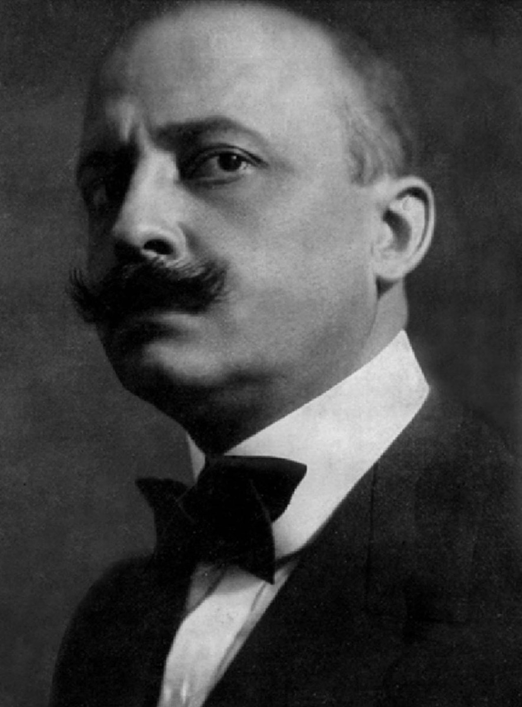
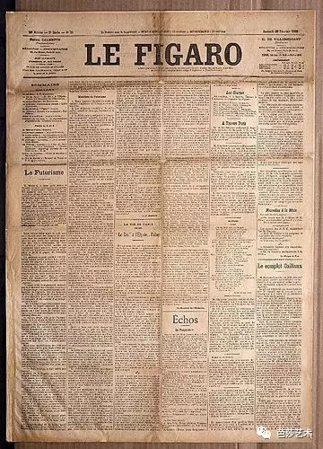

 2018-07-18 16:54:01

【按】意大利作家马里内蒂在1909年2月20日的《费加罗》报上发表了《未来主义宣言》，号召扫荡一切传统艺术、创建能与机器时代的生活节奏相合拍的全新艺术形式。未来主义由此诞生，并迅速由文学界蔓延渗透至美术、音乐、建筑、电影、摄影等各个领域。

## 《未来主义宣言》

　　我们——我和我的朋友们——彻夜未眠，我们的思想就像头顶上那盏盏清真寺的黄铜贺顶式吊灯一样熠熠闪光，因为我们的心在燃烧，如同灯丝放射出光芒。

　　我们践踏着祖传的惰性，在华丽的东方地毯上长久地来回踱步，在逻辑的极限内高谈阔论，同时挥笔写下许多愤激的言词。

　　我们的胸中充满巨大的自豪感，因为我们感到此刻惟有自己头脑清醒，昂首挺立，犹如面对从淡蓝色的营地里向外做敌意窥探的点点繁星而傲然屹立的灯塔和稳步前行的哨兵。陪伴我们的只有在巨轮的黑魆魆的锅炉上跳动的火焰；只有飞速奔驰的机车的通红的炉膛荡出的黑色精灵；只有跌跌撞撞在城里逛游的醉汉。

　　我们突然被吓了一跳，只听见一些双层有轨电车颠簸着驶过，噪音震耳欲聋，它们五光十色，如同节日的村庄突然间被泛滥的洪水冲塌和卷走，在洪水的激流和漩涡中出没浮沉。

　　随后是更加死气沉沉的寂静。但是，正当我们倾听衰老的运河疲乏地低声祈祷，垂死的大厦站在湿漉漉的草地上把骨头弄得吱吱嘎嘎直响的时候，我们突然听到窗下的汽车像饥饿的野兽般怒吼起来。

　　“走吧，”我说，“朋友们，我们走吧！出发！”终于，收拾起了神话和玄妙的理想！我们看见人马星座正在升起，不久就将看到早起的天使飞来！……应当推开生活之门，转动户枢和拔掉门闩吧！……我们出发了！看，最初的曙光露出地面了！没有什么能像太阳那样用鲜红的利剑一下子就割断我们几千年的黑暗！……

　　我们走到那三只大口喷着热气的野兽身旁，亲热地拍打它们滚烫的胸脯。我在自己的汽车里躺下，俨然是一具尸体摆在棺木里，但是我很快苏醒过来，驾驶盘像断头台上的利刀对准我的肚皮。

　　一股疯狂的劲头猛冲上来，驱使我们在像河床一样坑坑洼洼的塌陷害的街道上奔跑穿行，我们无法控制自己了。无论走到哪里，从窗后透过玻璃传出的灯光都是昏暗的，令我们怀疑模模糊糊看见的东西和准确性。

　　我高喊：野蛮只凭嗅觉就行了，嗅觉，嗅觉！

　　我们年轻力壮，像一只只披着黑色斑纹的雄狮一般，我们追赶死神，它朝着那朝气蓬勃的、泛着青紫色的广阔天空飞奔而去。

　　我们既没有一位想象中的情人，从云端露出华容的美姿，也没有一位狠心的女皇，可以为之献上我们缩成一只大戒指似的尸身。我们要去死，倘若不是想使我们的勇气彻底发挥的愿望过分强烈的话，决没有别的原因！

　　我们往前闯，撞到了那些站在屋前门槛上的看门狗，像用烙铁熨衣领一样，把它们碾死在我们灼热的车轮之下。死神已被我驯服，每次转弯都赶在我前面，温柔地向我挥舞爪子，并且不时地倒在地上，发出尖历的叫声，从种子那样充满自豪跳进大风旋转的巨大嘴巴里去吧！……我们甘愿被陌生吞噬，并不是由于绝望，而只是为了填平愚昧无知的深渊！

　　我刚说完这些话，自己猛然原地转起圈子来，就像想咬住自己的尾巴的狗那样带着一股疯狂的兴奋团团转。原来我突然碰上了两个骑自行车的人，他们像两种自成其理而又互相矛盾的理论那样在我面前互不相让，挡住了我的路，他们停在我去的路上愚蠢地争吵不休，……讨厌！唉！……我急刹车，由于生气，车轮飞出去我摔进了一条水沟里……

　　啊！慈母般的水沟里几乎尽是泥浆！可爱的工厂的废水沟呀！我贪婪地品尝你那含有养料的泥土，想起我的苏丹奶妈的神圣的黑乳房……。当我带着一身污泥和臭气从翻倒的汽车底下爬出来时，我感到愉快，心胸像被烙铁熨过一般地舒坦。

　　一群拿着渔秆的钓鱼者和腿脚肿胀的科学家们已经围在出事地点的四周议论纷纷。有些人准备好高大的支架和巨型的铁网，沉着细心地打捞我的汽车，这车活像一支搁浅的大鲨鱼。

　　汽车慢慢地从水沟里露出来，把整个沉重的外壳和舒适的软坐垫像鳞片一样脱落在沟底。

　　人们以为我那条鲨鱼死了，可一经我的手一抚摸，它就有了生气了，它苏醒了，它摆动强有力的鳍，又跑起来了！

　　此刻，带着满脸的工业污泥---其中混合着金属碎渣、蓝色的烟尘和汗水，我们，摔得鼻青眼肿、胳臂上缠着绷带，但是英勇无畏的气概犹存，向世界上一切热诚的人们倾诉我们的决心——未来主义宣言

　　1. 我们要歌颂追求冒险的热情、劲头十足地横冲直撞的行动。

　　2. 英勇、无畏、判逆，将是我们诗歌的本质因素。

　　3. 文学从古至今一直赞美停滞不前的思想、痴迷的感情和酣沉的睡梦。我们赞美进取性的运动、焦虑不安的失眠、奔跑的步伐、翻跟头、打耳光和挥拳头。

　　4. 我们认为，宏伟的世界获得了一种新的美——速度之美，从而变得丰富多姿。一辆赛车的外壳上装饰着粗大的管子，像恶狠狠地张嘴哈气的蛇……。一辆汽车吼叫着，就像踏在机关枪上奔跑，它们比萨色雷斯的胜利女神塑像更美。

　　5. 我们要歌颂手握方向盘的人类，他用理想的操纵杆指挥地球沿正确的轨道运行。

　　6. 为了提高人们奋发向上的原始热情，诗人必须勇敢豪迈、热诚慷慨地献出自己的生命。

　　7. 离开斗争就不存在美。任何作品，如果不具备进攻性，就不是好作品。诗歌意味着向未知的力量发起猛烈的攻击，迫使它们向人匍匐臣服。

　　8. 我们穿过无数世纪走到了尽头！……倘若我们一心要攻破一座“不可能性”的神秘莫测的大门，那为什么还要回过头来向后看呢？时间和空间已于昨天死亡。我们已经生活在绝对之中，因为我们已经创造了无处不在的，永不停息的速度。

　　9. 我们要歌颂战争——清洁世界的唯一手段，我们要赞美军国主义、爱国主义、无政府主义者破坏行为，我们歌颂为之献身的美丽理想，我们称赞一切蔑视妇女的言行。

　　10. 我们要摧毁一切博物馆、图书馆和科学院，向道德主义、女权主义以及一切卑鄙的机会主义和实用主义的思想开战。

　　11. 我们歌颂声势浩大的劳动人群、娱乐的人群或造反的人群；歌颂夜晚灯火辉煌的船坞和热气腾腾的建筑工地；歌颂贪婪在吞进冒烟的长蛇的火车站；歌颂用缕缕青烟作绳索攀上白云的工厂；歌颂像身躯巨大的健将一般横跨于阳光下如钢刀发亮的河流上的桥梁；歌颂沿着地平线飞速航行的轮船；歌颂奔驰在铁轨上胸膛宽阔的机车，它们犹如巨大的铁马套上钢制的缰绳；歌颂滑翔着的飞机，它的螺旋浆像一面旗帜迎风呼啸，又像热情有人群在欢呼。

　　我们从意大利向全世界发出这份具有冲击力和煽动性的宣言书，宣告我们于今天创立未来主义。我们的目的是要切除这个国家肌体上生长着的由教授、考古学家、导游者和古董商们组成的臭气熏天的痈疽。

　　意大利充当一个旧货市场的时期已经太长了。我们要把这个国家从数不清的博物馆中拯救出来，这些博物馆将无数的坟场墓地布满它的大地。

　　博物馆就是坟墓！……它从头何其相似，都是素昧生平的躯体的可悲的聚会场所。博物馆是让冤家仇人或者陌生的人们互相紧挨着长眠的公共寝室！博物馆是屠杀画家和雕刻家荒廖绝伦的屠宰场，让他们沿着竞争的墙壁，用色彩和线条互相残杀！

　　假如一年去朝拜一次，就像在亡灵节去扫墓那样，我同意去。假如每年供献一次鲜花于《蒙娜丽莎》之前，我同意你们做。……但是，我不允许人们终日徘徊在博物馆里，表现出诚惶诚恐、惆怅不已的病态激动。为什么要自寻烦恼？为什么要受腐蚀呢？

　　从未见过哪一幅旧画不是代表艺术家被扭曲的梦想？艺术家偿费尽心机也无法逾越重重障碍，安全表达出自己的意图。……欣赏一幅古典绘画，无疑所我们的情感灌注进一具棺材里，不如勇敢地投身于创作，在实践中发挥灵感。

　　这样漫无边际地欣赏过去的东西毫无益处，而且使人感到疲劳、沮丧和消沉，难道你们愿意这样浪费自己宝贵的精力吗？

　　我告诉你们，经常拜访博物馆、图书馆和科学院（那些地方是白白葬送辛劳的墓地、扼杀梦想的刑场、登记半途而废的奋斗的簿册……）对艺术家其实是有害的。也许，对于行将就木的老人、卧床不起的病人、身陷囹圄的囚徒是另一回事：尚可回味的过去也许对他们的疾病和痛苦是一贴镇痛剂。因为对他们来说，前途无可指望了。……但是我们不想了解过去那一套，我们是年轻的、强壮的未来主义者！

　　那么来吧，手指熏焦了的快乐的纵火者们！来吧！来吧！……干起来吧！你们点燃图书馆的书架！……你们把河水引来淹没博物馆！……呵，看着那些自命不凡的古画被撕破了，褪色了，在水面上随波逐流地飘浮，是多么地开心！……你们举起镢头、斧子、铁锤，毫不手软地捣毁那些受人尊敬的城堡吧！

　　我们当中最年长者30岁，因此我们至少还有十年时间来完成我们的事业。当我们40岁时，比我们更加有为、更加身手矫健的青年人将把我们像废纸一样扔进纸篓里。——我们甘愿这样！

　　我们的继承人将反对我们，他们将唱着自己的节奏迅急的歌曲，踏着舞步，伸开鹰爪般的手指，从远方走来，从四面八方走来，他们将在科学院的大门上像狗一样灵敏地嗅出我们腐烂的思想已经从图书馆的地下室里散发出臭气。

　　但是我们并不在那里。……他们最终将找到我们——在一个冬天的夜晚，在乡村的田野上，在被雨点单调地敲击着的棚顶下，他们将看见我们蹲在我们那还在振动的飞机旁边，正用我们自己现在写成的书燃成一堆小小的篝火，伸出双手在火上取暖，我们的身影在火光中摇曳。

　　他们将会团团围着我们，大叫大嚷，由于痛苦和失望而喘气不止。他们会被我的傲气和不见衰减的狂妄激怒，在嫉恨的驱使之下，将斗胆谋害我们性命，同时心里也会滋生对我们的爱慕和钦佩。

　　坦率的、强烈的邪恶之光从他们的眼睛里迸发出来，——艺术，说到底，不能不是暴力、残酷和邪恶。

　　我们当中最年长者30岁，然而我们已经浪费了财富——力量、爱情、勇气、智慧和雄心壮志等许多宝贵的东西。我们发狂似地匆匆把它们撒出去，不论多少，毫不犹豫，一鼓作气，从不间歇……。你们瞧瞧我们！我们还没有结婚！我们的心脏并不感到丝毫的疲劳，因为它燃烧着一团烈火，充满仇恨，跳动迅速！……你们惊奇吗？……这符合逻辑，因为你们甚至不记得你们经历过的一切了。我们昂首屹立于世界之巅，再次向宇宙间一切星球发出我们的挑战！

　　你们要驳我们吗？……罢了！罢了！我们熟悉那一套，我们全明白！……我们那迷人而虚伪的理智靠诉我们，我们是祖先们的再生延续。——也许是吧！……就算是这样吧！……那又有什么了不起呢？我们不予理睬！……重复这些无耻谰言的人决无好下场！……你们抬起头来听清楚！……

　　我们昂首屹立于世界之巅，我们再次向宇宙间一切星球发出我们的挑战！……

  

## 到底是什么
未来主义是发端于20世纪的艺术思潮，起初是一场文学运动，主要产生和发展于意大利，却也对其他国家产生影响，俄罗斯尤为明显。

未来主义者憎恶陈旧思想，尤其是陈旧的政治与艺术传统。他们热情讴歌的是现代机器、科技甚至战争和暴力。汽车、飞机、工业化的城镇等等在未来主义者的眼中充满魅力，因为这些象征着人类依靠技术的进步征服了自然。

未来主义者们将沉溺于昔日时光的行为戏称为“过去主义”，将这类人称为“过去主义者”。他们有时甚至对这些所谓的“过去主义者”们进行身体上的攻击。

未来主义者对现代战争大加颂扬，认为战争是艺术最终极的形式。一些未来主义者们曾是第一次世界大战的幸存者，怀有深刻的民族主义思想。这些经历使得他们在一定的时间里公然支持意大利的法西斯主义。但在1920年，马里内蒂和许多未来主义者们就已疏远了法西斯主义，并指责法西斯主义是“过去主义”。

#### 文学
未来主义文学歌颂工厂、桥梁、飞机和劳动者；赞扬战争和军国主义，称“战争是世界唯一的洁身之道”。速度、机械、暴力、技术等主题是未来主义诗歌中最常见的题材。马里内蒂在1912年甚至提出反理性、重直觉的非人化主张。他声称在文学中要消灭自我，消灭一切人的心理活动，最终以物质来代替人类。

#### 绘画
1910年3月8日，画家翁贝特·波丘尼（UmbertoBoccioni）、卡洛·卡拉（CarloCarra）、贾科莫·巴拉（GiacomoBalla）等发表了《未来主义画家宣言》，4月初又发表了《未来主义绘画技巧宣言》来表明他们的绘画技巧。从本质上说，未来主义绘画技巧源于立体主义，但在立体主义多视点的基础上加了表现速度和时间的因素。

赫伯特·里德曾在他的《现代绘画简史》中评价说，未来派画家对运动问题的解决方法带有几分稚气，“他们说，一匹奔驰的马不是有四条腿，而是有二十条腿，它们的运动是三角形的。于是他们画马、画狗、画人，都画成多肢体的东西，处在连续的或放射状的安排之中。”

#### 雕塑
1912年4月11日，波丘尼发表了《未来主义雕塑宣言》，他宣布：“绝对而彻底地抛弃外轮廓线和封闭式的雕塑，让我们扯开人体并且把它周围的环境也包括到里面来”

#### 建筑
1914年7月11日，意大利建筑师圣特里亚发表了《未来主义建筑宣言》，主张用机械的结构与新材料来代替传统的建筑材料，而城市的规划则以人口集中与快速交通相辅相成，建立一种包括地下铁路、滑动的人行道和立体交叉的道路网的“未来城市”计划。并用钢铁、玻璃和布料来代替砖、石和木材以取得最理想的光线和空间。

#### 服饰
《未来主义服饰宣言》号召人们废除色彩暗淡、线条呆板的服饰，代之以色彩鲜明，线条富有运动感的新服饰。

#### 摄影
未来主义摄影最早出现于20世纪初的意大利，强调运动、速度和力量，通过运动和速度状态来表现空间与时间。表现手法有影像重叠、虛实相辅、动作线化等，这些手法的运用丰富了摄影艺术视觉造型技巧。

#### 路途
未来主义作为意大利文化史体系的一个组成部分，它对起源于波希米亚的艺术本体形象进行反思，针对与法国一脉相承的文化体系进行革命，赞成不断创新的日尔曼文化模式。

未来主义坚决反对艺术市场化，反对把艺术降低为一些固有、刻板的标准。他们不愿意创造那些让他们丧失生命力的系列作品，拒绝屈从于使他们失去尊严、变得平庸而没有棱角的文化产业。

未来主义对20世纪其他文艺思潮也产生了影响，包括艺术装饰、漩涡主义画派、构成主义和超现实主义。未来主义作为一种艺术思潮从20年代开始衰落，如今已经基本绝迹，很多未来主义艺术家在两次世界大战中丧生。

然而，未来主义所倡导的一些元素至今仍然是西方文化的重要组成部分。未来主义对年轻、速度、力量和技术的偏爱在很多现代电影和其他文化模式中得以体现。比如，“人体金属化”、“赛博朋克”就是在未来主义的影响下出现的。

人们常常误将未来主义先锋运动与法西斯主义的各个组成部分联系在一起，指责未来主义那些具有煽动性的宣言都具有男权主义和军国主义的主题。事实上，每一种文化思潮都有其历史局限性与进步之处。罗马不是一天建成的，历史大潮会淘掉偏激片面，留下可建造未来的金石。