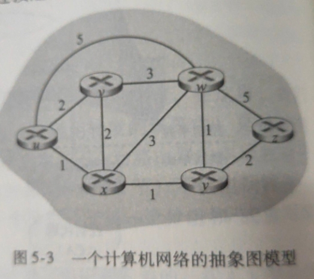
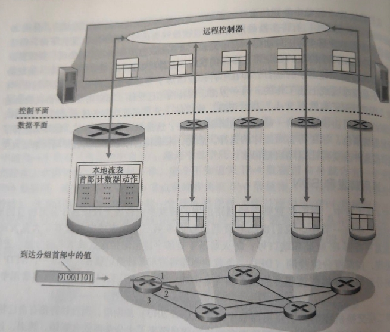
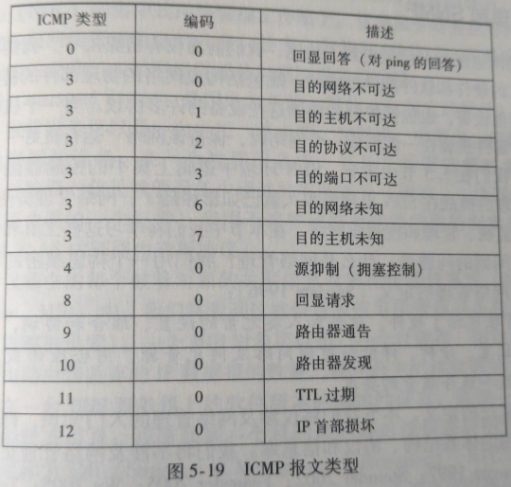
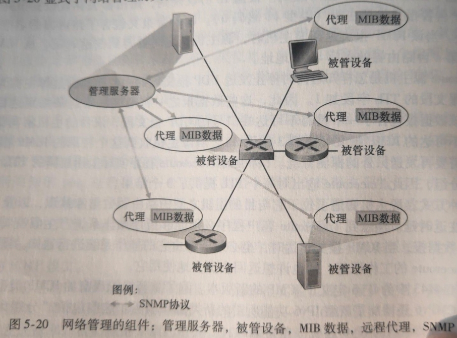
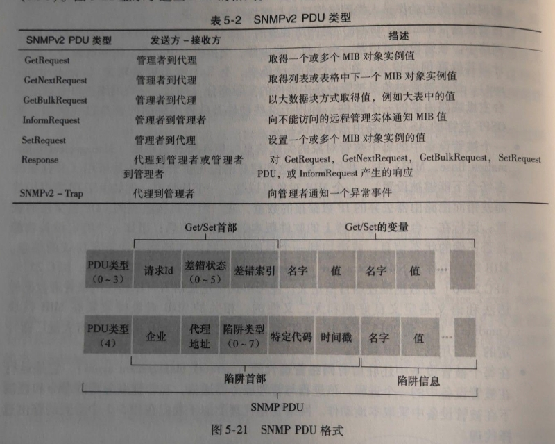

## 路由选择算法

**路由选择算法(routing algorithm)**的目的是确定网络中一个源到目的地之间的最低开销路径

通常划分为

- **集中式(centralized)路由选择算法**，需要提前确定所有路径上的开销，典型的如**链路状态(Link State, LS)算法**
- **分散式(decentralized)路由选择算法**，每个路由器通过迭代、分布式的计算出所需路径，典型的如**距离向量(Distance-Vector, DV)算法**

另外还可以分为**静态(static)**和**动态(dynamic)**路由选择算法、**负载明感(load-sensitive)**和**负载迟钝(load-insensitive)**算法
## AS
**自治系统(Autonomous System, AS)**由一组在相同管理控制下的路由器组成，目的是为了减少路由选择算法的规模，每个AS由全局唯一的AS号标识，其由ICANN区域注册机构分配

在同一个AS中运行的路由选择算法叫做**自治系统内部路由选择协议(intra-autonomous system routing protocol)**

**开放最短路优先(OSPF)**是一种AS内部的LS算法，使用洪泛链路状态信息和Dijkstra算法，其中的开销由管理员配置。其通告包含在OSPF报文中，由IP承载，上层协议值为89

**RIP协议(Routing Information Protocol, 路由信息协议)**，基于距离向量算法，适用于小型同类网络。其通过广播UDP报文(520)来交换路由信息，每30秒发送一次路由信息更新。使用**跳跃计数(hop count)**(一个包到达目标所必须经过的路由器的数目)作为尺度来衡量路由距离。只要跳跃计数相同，RIP则认为两个路由是等距离的。RIP最多支持的跳数为15，16为不可达

**IS-IS(Intermediate System-to-Intermediate System，中间系统到中间系统)协议**，使用最短路径优先算法，其定义较为复杂，具体参考：[详细笔记1](https://blog.51cto.com/wt7315/2085071)/[详细笔记2](https://baike.baidu.com/item/is-is)

用于在AS间的路径选择协议，称为**自治系统间路由协议(inter-autonomous system routing protocol)**。全球AS通用的协议是**边际网关协议(Broder Geteway Protocol, BGP)**

BGP采用距离向量算法

BGP有两个作用

1. 通告某个IP地址的存在。BGP使用179端口的半永久tcp连接交换路由信息。每条直接连接及其发送的BGP报文称为**BGP连接**。跨越AS的BGP连接(外部BGP连接, eBGP)的两个路由器称为**网关路由器(geteway router)**，其他的称为**内部路由器(internal router)**其连接叫内部BGP连接(iBGP)
2. 路由选择。在通告时，BGP将报告**BGP属性**，其中重要内容有：AS-PATH(已经通过的AS列表)和NEXT-HOP(AS-PATH的起始路由器接口地址)。BGP的路由选择算法基于**热土豆路由选择(hot potato routing)**

BGP还用于实现**IP任播(anycast)服务**。该服务通常处于DNS中，用于①替换不同服务器上的相同内容②让用户从最近的服务器访问内容
## SDN软件定义网络

通用转发表，通过*匹配+动作*的范式，对协议栈多个首部内容进行*匹配*，从而做到转发、负载均衡、防火墙等*动作*，是一般化的“分组交换机”

通用转发表经典标准为OpenFlow，其表称为**流表(flow table)**

SDN采用可编程的网络，使得可以通过SDN控制器的API来定义和控制网络设备
## ICMP
**因特网控制报文协议(ICMP)**用于端系统和路由器之间沟通网络层的信息，典型用途是差错报告

ICMP是作为IP载荷所承载，但其位于网络层

在ICMPv6中，添加了IPv6所需的类型和编码，如“分组太大”等
## 网络管理和SNMP

**被管设备(managed device)**中的每个**被管对象(managed object, 如网卡/协议内容等)**通过**网络管理代理(network management agent)**与**管理服务器**通信，之后被存储在**管理信息库(Management Information Base, MIB)**中

MIB对象由数据描述语言SMI(Structure of Management Information)所定义，收集在MIB模块中

代理和服务器之间使用**网络管理协议(network management protocol)**通信，典型的如**简单网络管理协议(Simple Network Management Protocol, SNMP)**

SNMP是应用层协议其报文通常称为协议数据单元(PDU)，基于UDP，通常有两种模式：①请求响应，服务器请求，代理响应；②异常陷阱，代理指示异常

