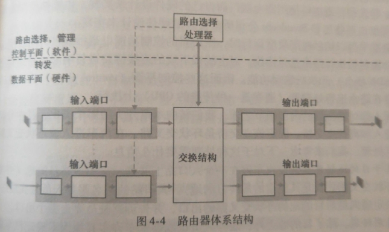
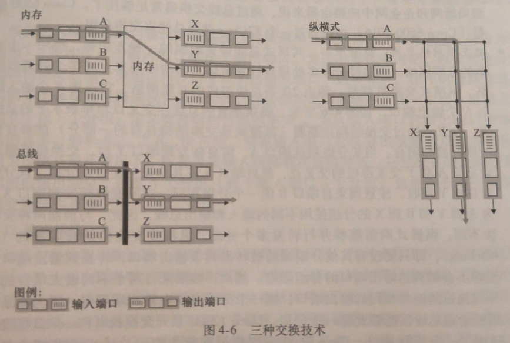
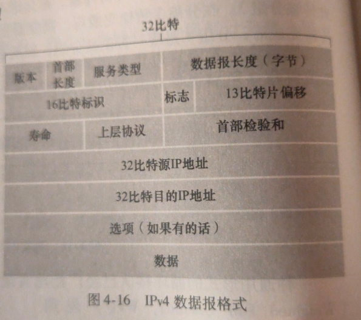
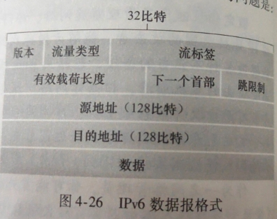

网络层由数据平面实现转发，控制平面实现路由选择

数据平面只涉及如何*决定到达路由器输入链路的数据报如何被转发*，转发通常由硬件实现

控制平面只涉及如何*控制数据报在路由器之间的路由方式*，路由选择通常由软件实现

因特网网络层提供单一服务，称为**尽力而为服务(best-effort service)**，尽力但不保证
## 路由器
路由器的端口是物理上意义的(如水晶母头)

- 输入端口执行终结物理层功能、和位于链路远端的数据链路层交互执行数据链路层功能、查询转发表执行转发功能
- 交换结构对输入端口和输出端口进行连接
- 输出端口存储接收的分组，并执行必要的链路层物理层功能
- 路由选择处理器执行控制平面功能，如更新转发表

路由器表通常通过**前缀匹配**来进行转发，当有多个匹配时，使用**最长前缀匹配规则(longest prefix matching rule)**

硬件通常采用**三态内容可寻址存储器(Tenary Content Address Memory, TCAM)**来实现查找转发表

如果出现输出端口竞争，将导致输入端口发生**线路前部阻塞(Head-Of-the-Line, HOL)**

如果出现输出端口阻塞，将有两种策略：弃尾或删头也可以在填满之前标记，这些策略统称为**主动队列管理(Active Queue Management, AQM)**，其中较重要的算法称为**随机早期检测(Random Early Detection, RED)**

缓存长度B：

- 经验公式：B = 平均往返时延RTT × 链路容量C
- 新进研究：B = RTT × C / √TCP流数量N

## 网际协议IP

- 标识、标志、片偏移指示IP分片信息
- 寿命(Time-To-Live)，保证数据报不会永远在网络中循环。每个路由器处理后该字段-1，为0丢弃
- 上层协议号作用类似于运输层的端口号
- 检验和通过对首部中的每两个字节当做一个数，之后求反码并求和得出

由于各个链路层协议的MTU不同，在不同的链路上将会被拆解成片，因此IPv4在接收端系统上将对数据报按照标识、标志和片偏移信息来进行组装

**DHCP(动态主机配置协议, Dynamic Host Configuration)协议**按照4个步骤分配地址：

1. DHCP服务器发现，通过**DHCP发现报文(DHCP discover message)**完成。使用0.0.0.0并广播地址255.255.255.255来广播
2. DHCP服务器提供，DHCP服务器使用**DHCP提供报文(DHCP offer message)**完成。使用本机IP并广播
3. DHCP请求，主机通过**DHCP请求报文(DHCP request message)**响应
4. DHCP ACK，服务器使用**DHCP ACK报文**响应

**网络地址转换(Network Address Translation, NAT)**用于扩展IP地址范围。NAT使用IP地址+端口号的方式映射局域网内的地址。因此NAT"路由器"并不是传统意义上的路由器。NAT可以通过**NAT穿越(NAT traversal)**工具或**通用即插即用协议(Universal Plug and Play, UPnP)**来修改

- IPv6将地址容量从32bit扩展到了128bit
- 首部长度固定为40字节
- 流量类型和IPv4服务类型字段含义类似
- 下一个首部含义和IPv4的上层协议字段相同
- 跳限制含义和IPv4的寿命字段相同

IPv6不允许路由器分片或组装，只能在端系统上进行。如果发生数据报太大，路由器将丢弃该数据报，并回答一个ICMP差错报文
**建隧道(tunneling)**是从IPv4迁移到IPv6的一种方法。使用IPv4的数据报包裹IPv6，并指示上层协议号为41即可