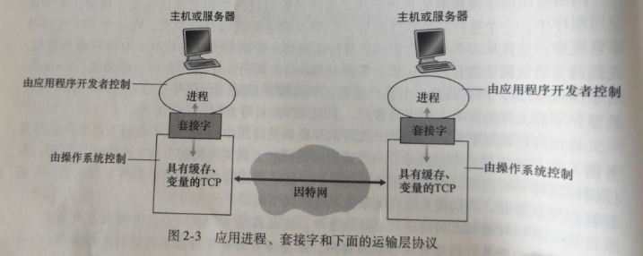
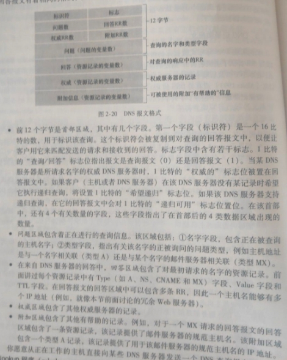

### 应用层协议原理
应用程序由通信进程对组成。每对中的两个进程互相发送报文。进程通过**套接字(socket)**向网络发送或请求报文

套接字是同一台主机内应用层和运输层之间的接口

SSL是在应用层实现的，是对TCP的一种加强

为了寻址，因此主机由**IP地址**标识；进程由**端口号(port number)**标识（[固定端口参考](https://www.iana.org)）
### 应用层协议
**应用层协议(application-layer protocol)**定义了运行在不同端系统上的应用程序如何相互传递报文。

**非持续连接(non-persistent connection)**指每个请求/响应对是经一个单独的TCP连接发送

**持续连接(persistent connection)**指所有请求及响应经相同的TCP连接发送
### DNS
用于将主机名解析为ip地址的服务

DNS是

1. 一个由分层的****DNS服务器实现的**分布式数据库**
2. 一个使得主机能够查询分布式数据库的**应用层协议**

DNS服务器通常是运行BIND(Berkeley Internet Name Domain)软件的UNIX机器。DNS协议运行在UDP之上，使用53端口

**递归查询**指该查询以自己的名义请求；
**迭代查询**指所有回答都是直接返回其他ip地址

通常的查询都遵从：从请求主机到本地dns服务器的查询是递归的，其余查询是迭代的
#### DNS记录和报文
whois数据库是所有已注册域名的列表

DNS服务器存储了**资源记录(Resource Record, RR)**，RR提供了主机名到ip地址的映射。RR是一个四元组`(Name, Value, Type, TTL)`

其中，TTL指该记录的生存时间，决定了RR应该从缓存中删除的时间；Name和Value的值取决于Type

- 若Type=A, 则Name是主机名，Value是其对应ip
- 若Type=NS, 则Name是个域，Value是储存该域主机ip地址的权威DNS服务器的主机名
- 若Type=CNAME, 则Value是别名为Name的主机对应的规范化主机名
- 若Type=MX, 则Value是别名为Name的邮件服务器的规范化主机名

DNS只有查询和回答这两种报文，其格式相同

DNS查询可以通过`nslookup`命令手动查询

DNS中RR的增删由**注册登记机构(registrar)**控制，其由[因特网名字和地址分配机构(Internet Corporation for Assigned Names and Numbers, ICANN)](https://www.internic.net)授权
### 简单套接字编程
```python{numberLines: true}
#UDPClient.py
from socket import *
serverName = "hostname"; serverPort = 12000
clientSocket = socket(AF_INET, SOCK_DGRAM)
msg = raw_input("input: ")
clientSocket.sendto(msg.encode(), (serverName, serverPort))
modifiedMsg, serverAdd = clientSocket.recvfrom(2048)
print(modifiedMsg.decode())
clientSocket.close()
#UDPServer.py
from socket import *
serverPort = 12000
serverSocket = socket(AF_INET, SOCK_DGRAM)
serverSocket.bind(("", serverPort))
print("server ready to receive")
while True:
　　msg, clientAdd = serverSocket.recvfrom(2048)
　　modifiedMsg = msg.decode().upper()
　　serverSocket.sendto(modifiedMsg.encode(), clientAdd)
#TCPClient.py
clientSocket = socket(AF_INIT, SOCK_STREAM)
clientSocket.connect((serverName, serverPort))
clientSocket.send(msg.encode())
#TCPServer.py
serverSocket = socket(AF_INIT, SOCK_STREAM)
serverSocket.bind(("", serverPort))
serverSocket.listen(max=10)
while True:
　　connectSocket, addr = serverSocket.accept()
　　msg = connetSocket.recv(1024).decode().upper().encode()
　　connectSocket.send(msg)
　　connectSocket.close()
```