主机通过**无线通信链路(wireless communication link)**连接到一个基站或另一台无线主机

**基站(base station)**在有限网络中没有明确的对应设备，其负责向与之关联的主机发送或接收数据，并协调多个主机信号的传输。典型的有蜂窝网络中的**蜂窝塔(cell tower)**和802.11中的**接入点(access point)**

与基站关联的主机以**基础设施模式(infrastructure mode)**运行，地址分配等网络服务由基站提供

**自组织网络(ad hoc network)**中，主机自身提供地址分配等网络服务

主机从一个基站到另一个基站的过程称为**切换(handoff)**

无线网络大致分为

1. *单跳，基于基础设施*。如802.11和4G移动网
2. *单跳，无基础设施*。如蓝牙网络和具有自组织模式的802.11网络
3. *多跳，基于基础设施*。如无线传感网络和无线网状网络(wireless mesh network)
4. *多跳，无基础设施*。如移动自组织网络(mobile ad hoc network, MANET)和车载自组织网络(vehicular ad hoc network, VANET)
## WiFi: 802.11无线LAN
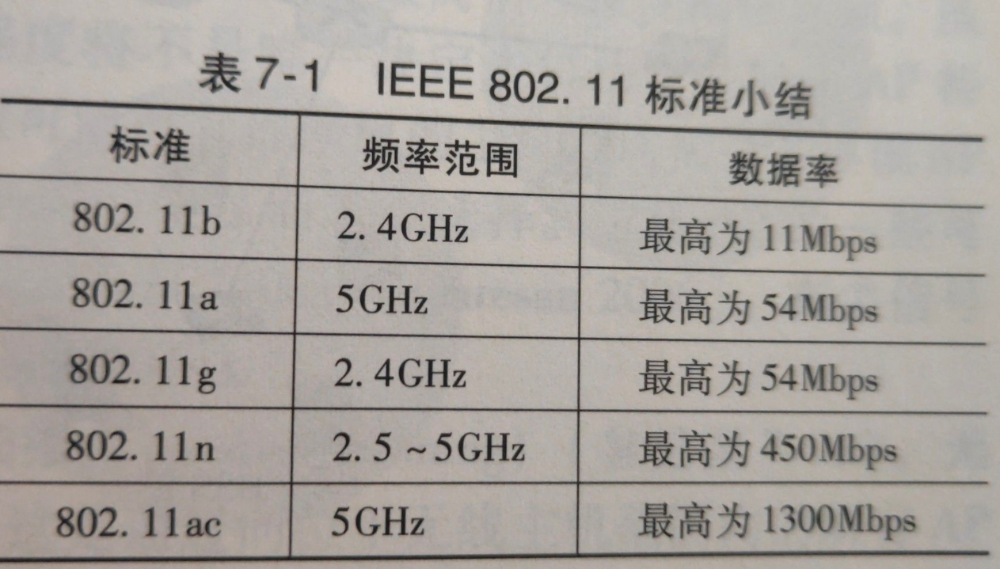
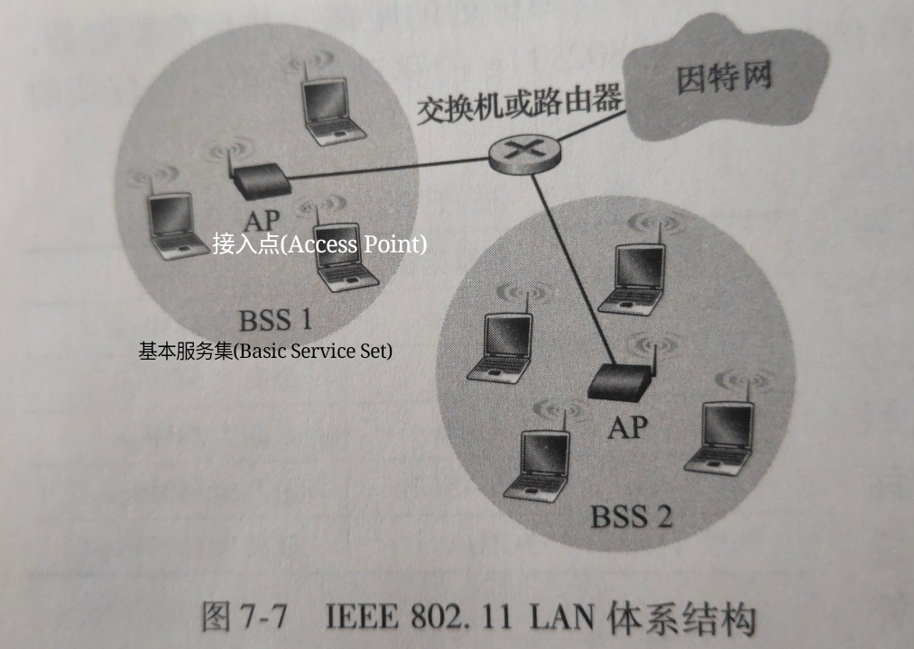
802.11使用**带碰撞避免的CSMA(CSMA with collision aviodance, CSMA/CA)协议**来协商多路访问

由于无线信道较好的比特差错率(BER)，802.11使用**链路层确认/重传(ARQ)**。源站点监听到信道空闲，即等待**分布式帧间间隔(Distributed Inter-Frame Space, DIFS)**，然后发送帧；在目标站点收到CRC检验帧后，将等待**短帧间间隔(Short Inter-Frame Spacing, SIFS)**，然后发送一个确认帧。

在发送长数据时，源站点和目标站点会通过**请求发送(Request to Send, RTS)帧**/**允许发送(Clear to Send, CTS)帧**来避免碰撞
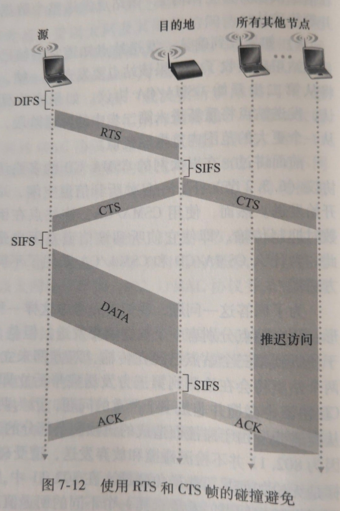
802.11运行在2.4~2.4835GHz的频段中。其中有11个部分重叠的信道。当且仅当两个信道间隔≥4时才无重叠，特别是1/6/11是唯一的3个非重叠信道集合

同以太网类似，每个AP接口和主机都有一个6字节的MAC地址，存储于802.11网络接口卡中

当安装一个AP时，需要分配一个单字或双字的**服务集标识符(Service Set Indentifier, SSID)**和一个信道号

接入AP的步骤
1. 每个AP周期性的发送**信标帧(beacon frame)**，无线主机也周期性扫描11个信道来确定周围的AP。选择被动扫描或主动扫描来监听信标帧
2. 对用户鉴权。基于MAC地址或AP通过RADIUS, DIAMETER等协议与鉴权服务器通信
3. 接入后通过AP发送DHCP发现报文获取IP地址
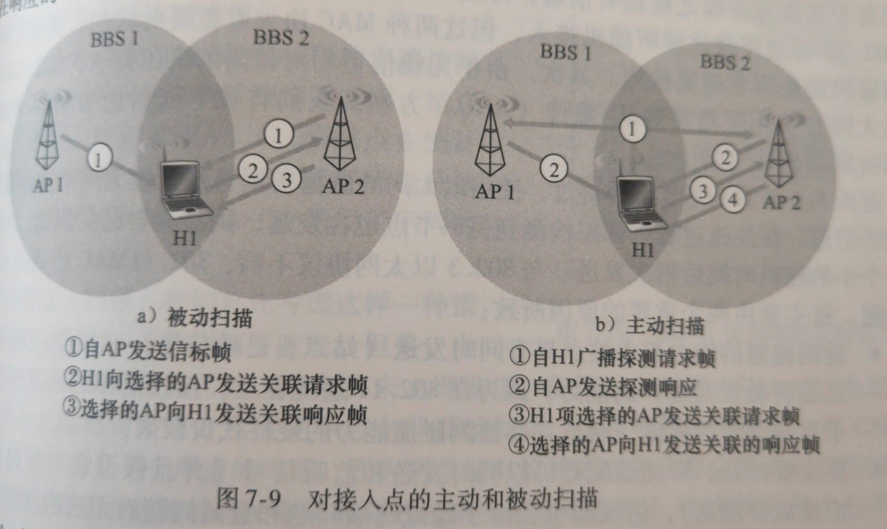
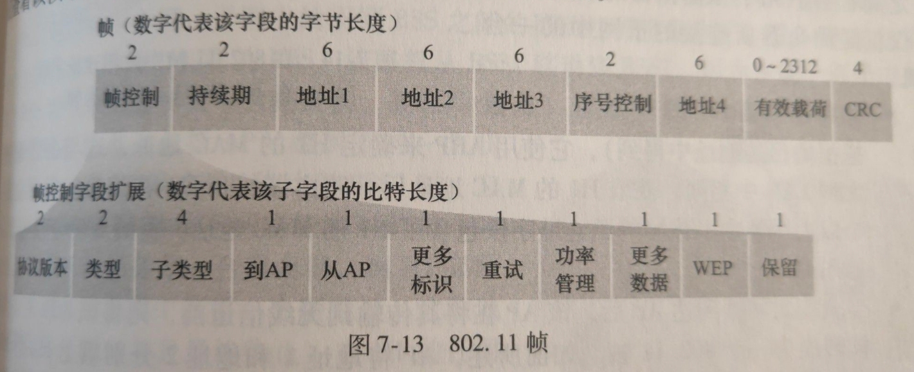
- 类型和子类型区分关联、RTS、CTS、ACK和数据帧
- WEP指示是否加密
- 持续期指ETS/CTS控制的持续时间
- 序号控制和运输层作用类似
- 地址1是接收的无线站点MAC地址，地址2是源站点MAC地址，地址3是路由器MAC地址，地址4是自组织模式互相转发时使用
## 蓝牙: 802.15.1
IEEE 802.15.1网络有时被称为**无线个人域网络(Wireless Personal Area Network, WPAN)**，其链路层和物理层基于蓝牙规范

802.15.1以TDM方式工作在2.4GHz无线电波段，每个时隙长度为625μs

每个时隙内，发送端利用79个信道中的一个传输，并通过伪随机方式变更信道，该方式称为**跳频扩展频谱(Frequency-Hopping Spread Spectrum, FHSS)**

802.15.1是自组织网络，其网络称为**皮可网(piconet)**。其将指定一个设备为主设备，其时钟确定了皮可网的时间
## ZigBee: 802.14.5
802.14.5是用于低功率、低工作周期设备的WPAN

ZigBee以超帧工作，分为活跃周期(传输数据)和非活跃周期(保存能量)
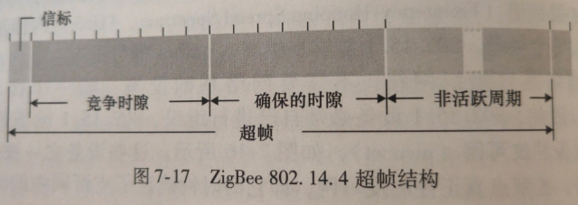
## 蜂窝网
其标准是**全球移动通信系统(Groupe Spécial Mobile, GSM)**
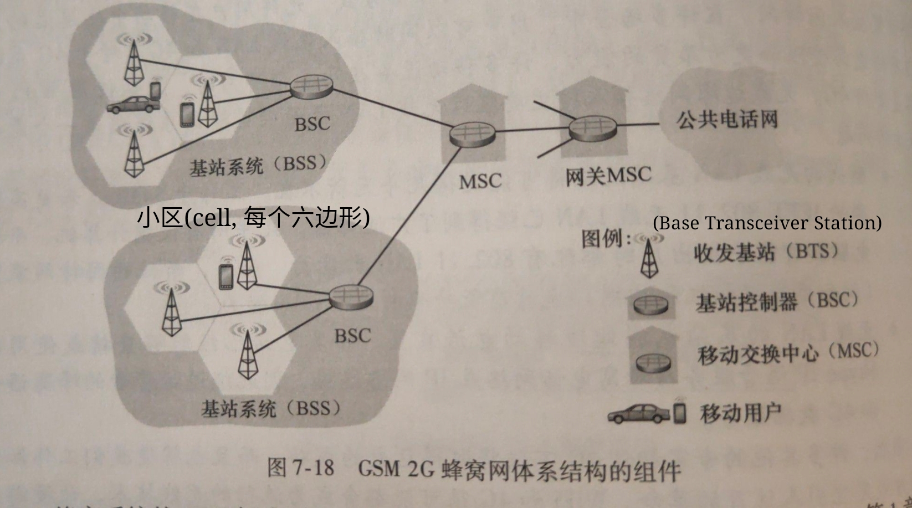
BSC用于向用户分配BTS无线信道，执行**寻呼(paging)**(找出其所在小区)

MSC负责用户鉴权、管理和呼叫的建立及切换

2G使用组合的FDM/TDM来控制多路访问

从2G起，标准就不再统一。之后讨论基于第三代合作伙伴项目(3rd Generation Partnership Project, 3GPP)研发的通用移动通信服务(Universal Mobile Telecommunications Service, UMTS)的3G和4G
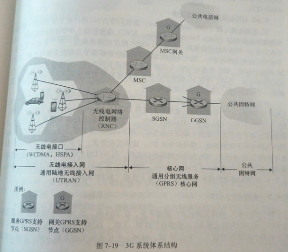
- SGSN负责维护用户认证和切换，并提供交付/提供数据报服务
- GGSN起到网关作用
- RNC类似于2G的基站，既连接MSC与电路交换蜂窝语音网络连接，也通过SGSN与分组交换的因特网连接

在TDM时隙中(兼容2G)，UMTS使用**直接序列宽带CDMA(Direct Sequence Wideband CDMA, DS-WCDMA)技术**提供多路访问，且配合**高速分组接入(High Speed Packet Access, HSPA)**传输数据
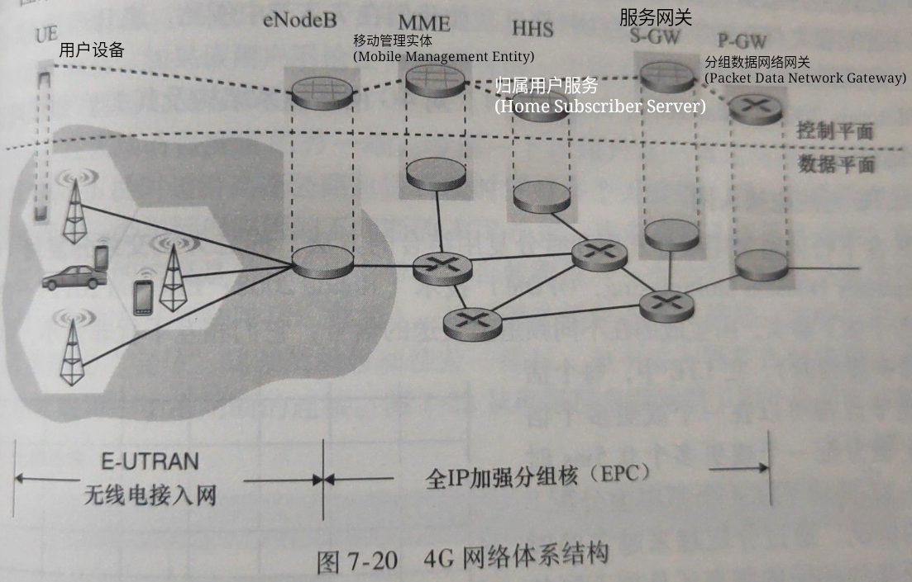
- eNodeB类似于3G的RNC。UE的数据报在此封装，并通过EPC以隧道方式(类似于IPv4-IPv6隧道)传递给P-GW
- P-GW给UE分配IP地址，并保证服务质量(QoS)的实施
- S-GW拦截流量和处理流量数据，并执行收费记账功能
- MME执行连接和移动管理
- HSS包含漫游、鉴权等服务

LTE中，语音和数据都承载在IP数据报中

LTE中使用**正交频分复用(Orthogonal Frequency Division Multiplexing, OFDM)技术**来处理多路访问
## 处理移动
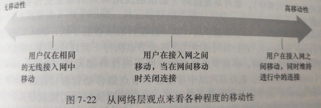
处于高移动性的用户使用移动IP，其允许移动节点在网络移动时维持永久的IP地址

一个移动节点的永久居所被称为**归属网络(home network)**，在归属网络中代表移动节点执行移动管理功能的实体称为**归属代理(home agent)**

移动节点当前所在的网络叫**外部网络(foreign network, 或被访问网络(visited network))**，在外部网络中帮助移动节点做移动管理功能的实体称为**外部代理(foreign agent)**

外部代理①为移动节点产生**转交地址(Care-Of Address, COA)**，COA属于外部网络的一部分，②和归属网络通信，使得归属代理维护移动节点本身地址(永久地址)
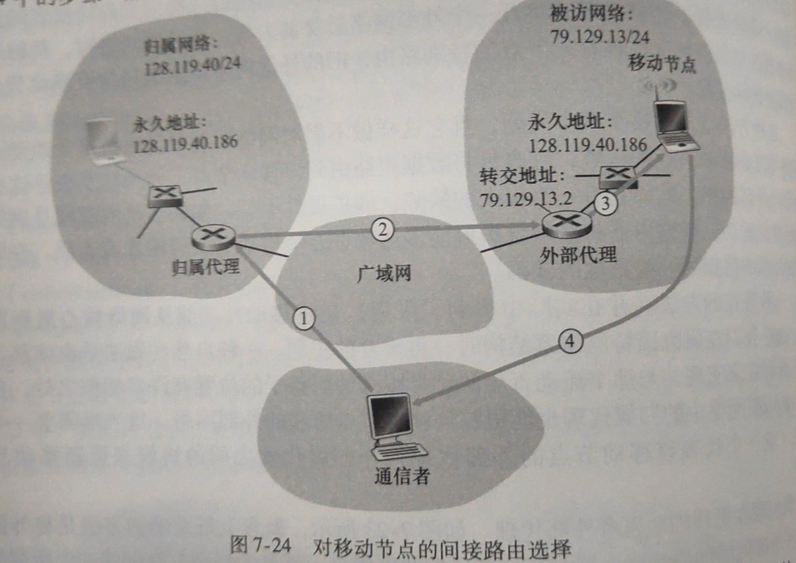
1. 通信者使用移动节点的永久地址作为目标地址寻址
2. 归属代理封装数据报，转发给外部代理
3. 外部代理将COA地址作为目标地址发送
4. 移动节点使用其永久地址发送至通信者

间接路由选择会产生**三角路由问题(triangle routing problem)**，导致运行低效
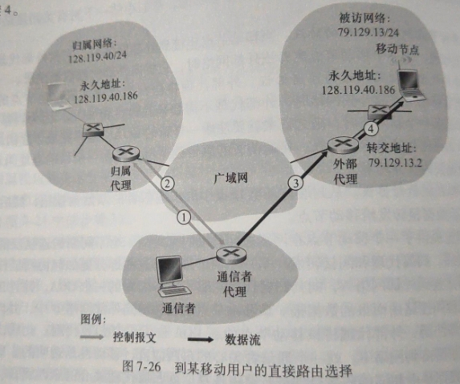
1.2. 通信者代理和归属代理交互，获取移动节点的COA
3.4. 通信者使用获取到的COA直接和外部代理通信

直接路由选择会导致移动问题，但可以使用**锚外部代理(anchor foreign agent)**解决。在移动节点移动时(产生新代理和新COA)，在步骤3时锚外部代理将重新和新代理之间交换新COA，然后处理数据
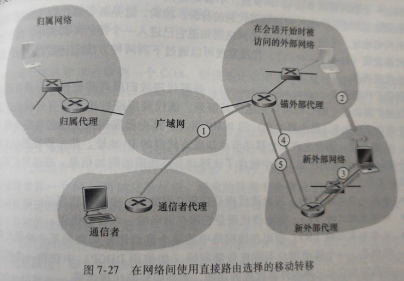
使移动节点中的网络层知道进入新的外部网络的过程称为**代理发现(agent discovery)**。其有两种方式实现：代理通告或代理请求

- **代理通告(agent advertisement)**使用现有的路由器发现协议的扩展协议(RFC 1256)来通告。代理周期性的在所有连接的链路上广播ICMP报文
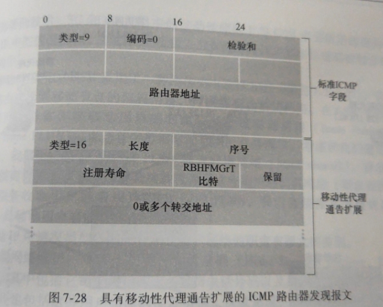
- **代理请求(agent solicitation)**中移动节点使用类型=10的ICMP报文广播。代理收到广播后将单播一个代理通告

代理发现后移动节点还需要**代理注册**。其步骤为：移动节点向外部代理发送注册报文(UDP, 434)，外部代理向归属代理注册(UDP, 434)，归属代理鉴权，外部代理接收注册响应转发给移动节点