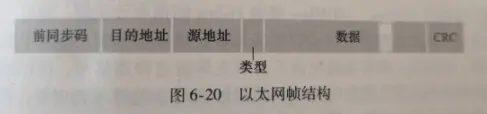

从链路层协议上看，所有设备都是一个**节点**，通信路径上相邻节点的通信信道称为**链路**

链路层大多数是在**网络适配器(network adapter, 有时称为网络接口卡(Network Inerface Card, NIC))**中实现，因此大多功能由硬件实现，但也有少部分由 CPU(软件)实现

链路层使用**循环冗余检测编码(Cyclic Redundancy Check, CRC, 有时也被称为多项式编码(polynomial code))**来做到**比特级差错检测和纠正(bit-level error detection and correction)**

链路层使用**媒体访问控制协议(Medium Access Control, MAC)**来规定帧在链路上的传输规则

## 多路访问链路及其协议

**广播链路(broadcast link)**使得多个发送和接收节点能连接到相同单一的共享的广播信道上，其使用**多路访问协议(multiple access protocol)**处理信号**碰撞(collide, 即同时收到多个帧而必须丢弃)**

多路访问协议可以划分为 3 种类型

- 信道划分协议，如**时分多路复用(TDM)**和**频分多路复用(FDM)**、**码分多址(CDMA)**
- 随机接入协议，如
    - **ALOHA 协议簇**：纯 ALOHA、时隙 ALOHA
    - **CSMA 协议簇**：载波监听多路访问(Carrier Sense Multiple Access, CSMA)、具有碰撞检测的 CSMA(CSMA/CD)
- 轮流协议，
    - **轮询协议簇**：802.15 协议、蓝牙协议
    - **令牌传递协议簇**：光纤分布式数据接口协议(FDDI)、IEEE 802.5 令牌环协议

## 交换局域网

网络适配器(端系统和路由器上有, 交换机上没有)具有链路层地址，其地址通常被称为 LAN 地址、物理地址或 MAC 地址

**地址解析协议(Address Resolution Protocol, ARP)**负责转换 IP 地址和 MAC 地址，由端系统和路由器的 ARP 表负责维护和创建映射关系

**集线器(hub)**的作用只是重新生成比特，将其能量强度放大并向其他所有接口传输

- 前同步码(8 字节)，前 7 字节用于同步时钟，第 8 字节的两个比特用于指示有效数据
- 目的地址(6 字节)，包含目的适配器的 MAC 地址
- 类型(2 字节)，指示上层协议类型
- 数据(46~1500 字节)，多余分片，少则填充
- CRX(4 字节)，循环冗余检测数据

以太网向网络层提供面向无连接的、不可靠的服务

以太网标准为 IEEE 802.3 CSMA/CD(Ethernet)

在基于交换机的以太局域网中不会有碰撞，因此不需要 MAC 协议

交换机的任务是接收入链路层帧并转发到出链路，作用是转发和过滤

交换机使用**交换机表(switch table)**处理转发，其表的生成是*自学习*的
