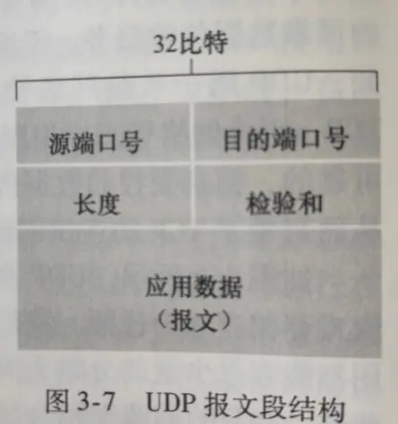
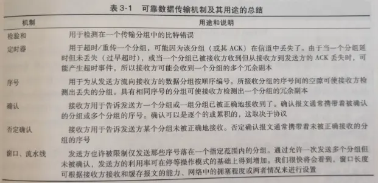
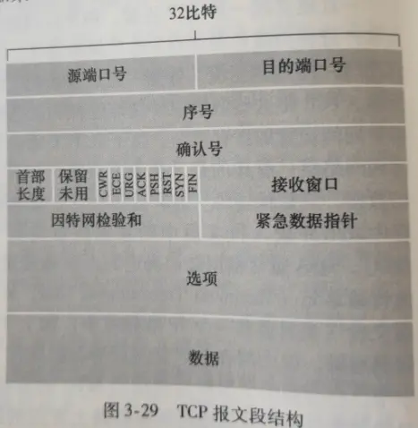
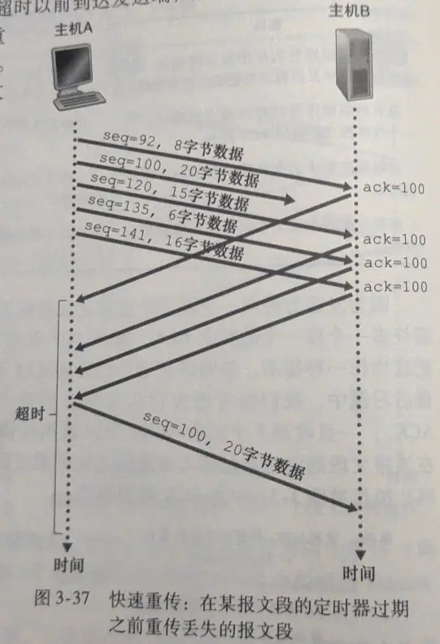
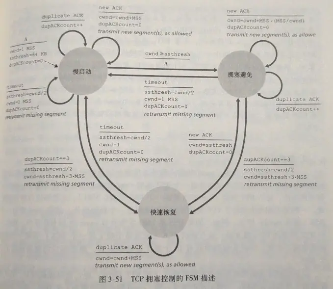

网络层提供了主机之间的逻辑通信，而运输层为运行在不同主机上的进程之间提供了逻辑通信。因此**运输层协议只工作在端系统上，路由器只处理到网络层**

将主机间交付扩展到进程间交付被称为**运输层的多路复用(transprot-layer multiplexing)**，将数据块封装上首部信息生成报文段并传递到网络层；**多路分解(demultiplexing)**，将将运输层报文段的数据交付到正确的套接字

通常，UDP 协议里，应用程序的客户端让运输层自动的(且透明的)分配端口号，而服务端分配特定的端口号，不同源地址或不同源端口都没有关系，只要目标端口、目标主机地址相同，都会被分配到同一套接字

而 TCP 协议里，**不同源地址或不同源端口都会被定向到不同的套接字**，只有源端口号、源主机地址、目标端口号和目标端口地址相同时才会被分配到同一套接字

**数据报拥塞控制协议(Datagram Congestion Control Protocol, DCCP)**实现了面向报文、控制拥塞的类似 UDP 不可靠服务

### UDP

除了复用/分解功能及少量的差错检测外，UDP 几乎没有对 ip 增加别的东西。

DNS 协议运行在 UDP 之上

UDP 可以实现可靠传输的，但是在应用层实现。如 Chrome 的 QUIC(快速 UDP 因特网连接)

UDP 首部只有 4 个字段，共 64bit, 8 字节

- 长度字段指明 UDP 报文段的总字节数(首部+数据)
- 检验和为 UDP 提供差错检测功能

### 可靠数据传输原理

**比较复杂，笔记没用。看书！！！**

### TCP

TCP 是面向连接、全双工、点对点的协议

TCP 报文段的长度受限于**最大报文段长度(Maximum Segment Size, MSS)**，而 MSS 通常根据主机的**最大链路帧长度(AKA 最大传输单元 Maximum Transmission Unit, MTU)**来设置。如底层以太网协议和 PPP 链路层协议 MTU=1500 字节，MSS 典型值就是 1460 字节(加首部 40 字节，共 1500)。

TCP 首部共有 20 字节，但可变

- 序号和确认号用来实现可靠数据传输(各 32bit)
- 接收窗口字段指示接收方愿意接收的字节数(16bit)
- 首部长度字段指示以 32bit 为单位的 TCP 首部长度(4bit)
- 选项字段用于协调窗口调节(可选+变长)
- 标志字段用于控制 TCP 状态，如 ACK, FIN(6bit)

TCP 对于失序的报文段会整理成序再发给应用层

TCP 的初始序号可以随机选择，以减少将仍在网络上的旧连接的报文段，误认为是新连接的报文段的可能性(防止和旧连接使用同一端口)

TCP 在收到三次**冗余 ACK**（同一 ACK 回复）时，会触发**快速重传(fast retransmit)**，即在该报文段的定时器过期之前就重传

TCP 提供**流量控制服务(flow-control service)**，以消除发送端使得接收端缓存溢出的可能。发送端需要控制`LastByteSent - LastByteAcked ≤ rwnd`，其中，rwnd 是首部的接收窗口字段，rwnd=RcvBuffer - [LastByteRcvd - LastByteRead]。在 rwnd 为 0 时，发送端会一直发送只有一字节数据的报文段，直到返回非 0 的 rwnd 值。

TCP 通过三次握手，四次挥手工作。SYN 洪泛攻击可以通过设置 SYN cookie 来防御

TCP 提供**拥塞控制(congestion control)**来减少网络环境对连接的影响。即`LastByteSent - LastByteAcked ≤ min{ rwnd, cwnd }`，其中，cwnd 代表拥塞窗口通过**TCP 拥塞控制算法(TCP comgestion control algorithm)**来控制：

初始状态为 A，sshresh 为一阈值
